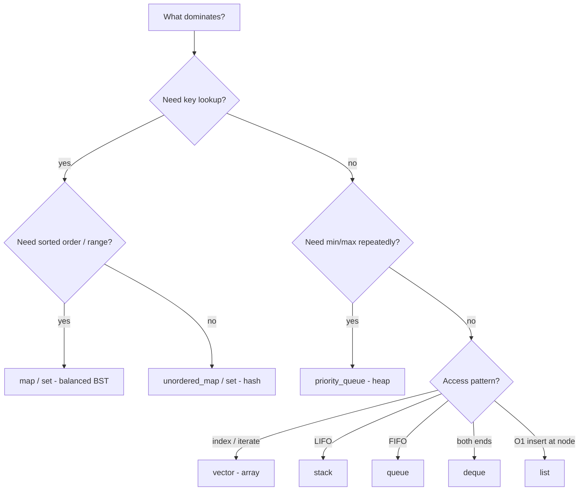

# Chapter 7 — Comparisons & Design Thinking

[← Back to Table of Contents](README.md)

> Knowing a structure is easy. Knowing **when to choose it** is what separates engineers. This chapter is about decision-making under constraints.

---

## 7.1 Head-to-Head Comparisons

### 7.1.1 Stack vs Queue

| | Stack | Queue |
|---|---|---|
| Order | **LIFO** (last in, first out) | **FIFO** (first in, first out) |
| Insert / Remove | same end (top) | opposite ends (rear / front) |
| Analogy | stack of plates | line at a counter |
| Traversal use | **DFS** (depth-first) | **BFS** (breadth-first) |
| Typical uses | undo, recursion, parsing, backtracking | scheduling, buffering, level-order |

**When to use what:** reach for a **stack** when the *most recent* item should be handled first (nesting, backtracking, "undo last"). Reach for a **queue** when items must be processed in *arrival* order (fairness, pipelines, BFS).

💡 DFS and BFS differ *only* by the data structure: swap the stack for a queue and depth-first becomes breadth-first.

---

### 7.1.2 Heap vs BST (balanced)

| | Heap | Balanced BST |
|---|---|---|
| Ordering | partial (parent vs children) | total (in-order = sorted) |
| Find min/max | **O(1)** | O(log n) |
| Search arbitrary | **O(n)** | **O(log n)** |
| Insert / Delete | O(log n) | O(log n) |
| Sorted traversal | ❌ no | ✅ yes |
| Range queries | ❌ | ✅ (`lower_bound`, etc.) |
| Memory | array, compact | nodes + pointers |
| Backing | array | tree (`std::set/map`) |

**When to use what:**
- Need only the **extreme element repeatedly** (top-K, scheduler, Dijkstra)? → **Heap.** O(1) peek, compact.
- Need **search, ordered iteration, predecessor/successor, or range queries**? → **BST** (`std::set`/`map`).

💡 A heap is a *specialist* (min/max only); a BST is a *generalist* (full ordering). Don't pay for ordering you won't use.

---

### 7.1.3 DFS vs BFS

| | DFS | BFS |
|---|---|---|
| Strategy | go deep, then backtrack | explore level by level |
| Data structure | stack / recursion | queue |
| Shortest path (unweighted) | ❌ not guaranteed | ✅ guaranteed |
| Memory | O(h) = height/depth | O(w) = max width |
| Finds a path fast | ✅ (deep solutions) | ✅ (shallow solutions) |
| Typical uses | cycle detection, topo sort, connected components, backtracking | shortest path, level order, "min steps" |

**When to use what:**
- **Shortest path / fewest steps** on an unweighted graph → **BFS** (it reaches nodes in distance order).
- **Cycle detection, topological sort, exhaustive search, "does a path exist"** → **DFS** (cheaper memory on deep/narrow graphs).
- **Memory tradeoff:** DFS is O(depth); BFS is O(width). On a wide, shallow graph DFS saves memory; on a deep, narrow one BFS may.

⚠️ DFS does **not** find shortest paths. BFS on weighted graphs gives fewest-*edges*, not least-*weight* (use Dijkstra for weights).

---

### 7.1.4 Array vs Linked List

| | Array (`vector`) | Linked List (`list`) |
|---|---|---|
| Access by index | **O(1)** | O(n) |
| Insert/delete at end | O(1) amortized | O(1) |
| Insert/delete at front | O(n) | **O(1)** |
| Insert/delete in middle | O(n) (shift) | O(1) *given the node* |
| Search | O(n) | O(n) |
| Memory layout | contiguous | scattered nodes |
| Cache performance | **excellent** | poor (pointer chasing) |
| Memory overhead | minimal | pointer per node |
| Resizing | reallocate + copy | no reallocation |

**When to use what:**
- **Default to arrays/`vector`.** Random access, cache locality, and low overhead win in the vast majority of cases — *even for many middle insertions*, because cache-friendly shifting often beats pointer-chasing.
- Use a **linked list** only when you have **frequent O(1) insert/delete at known positions** (you already hold the node/iterator) and you **never index**, e.g., LRU cache internals, splicing, intrusive lists.

💡 **Benchmark before choosing a linked list.** Modern CPUs make `std::vector` faster than `std::list` for most "list-like" workloads due to cache effects.

---

## 7.2 Choosing the Right Data Structure — A Decision Guide

Ask these questions in order:

1. **What operations dominate?** (access by index, search by key, insert/delete, min/max, range queries.)
2. **How often does each happen?** Optimize the frequent path.
3. **Is ordering needed?** Sorted iteration / range queries → tree; otherwise hash.
4. **What are the size and memory limits?**
5. **Worst-case guarantees needed?** (real-time / adversarial input) → avoid hash (O(n) worst), prefer balanced tree / heap.

| You need… | Use |
|---|---|
| Index access, iteration, append | `std::vector` (array) |
| Fast key lookup, no ordering | `std::unordered_map` / `unordered_set` |
| Sorted keys + range/`lower_bound` queries | `std::map` / `std::set` |
| Min/max repeatedly (priority) | `std::priority_queue` (heap) |
| LIFO | `std::stack` |
| FIFO | `std::queue` |
| Both ends O(1) | `std::deque` |
| Prefix / autocomplete | Trie |
| Range sum/min/max with updates | Segment tree / BIT |
| Connectivity / merge groups | Union-Find |
| O(1) insert/delete at known node | `std::list` |

---

## 7.3 Time–Space Tradeoffs in Practice

Almost every optimization spends one resource to save another:

| Technique | Spends | Saves |
|---|---|---|
| Hash map lookup | memory (O(n)) | time (O(n)→O(1)) |
| Memoization / DP table | memory | recomputation time |
| Prefix sums / sparse table | precompute time + memory | per-query time |
| Sorting before queries | O(n log n) once | many O(log n) searches |
| Compression / bitset | CPU time | memory |
| Recomputation | time | memory |
| Streaming (don't store all) | accuracy/flexibility | memory (O(1)/O(k)) |

**Guiding principles:**
- **Read-heavy + repeated queries?** Invest in **preprocessing** (sort, index, precompute).
- **Write-heavy?** Favor structures with cheap updates (hash table, Fenwick tree).
- **Memory-constrained (embedded, huge data)?** Stream, compress, or use in-place algorithms.
- **Latency-critical / real-time?** Favor **predictable worst-case** (balanced tree, heap) over average-case (hash, quicksort).

---

## 7.4 Scalability & Systems Thinking

DSA choices ripple into system design:

- **Asymptotics dominate at scale.** O(n²) that's fine at n=1,000 is a meltdown at n=10⁷. Pick complexity for your *target* scale, not today's data.
- **Constant factors & cache matter** once asymptotics are equal. Contiguous structures (vectors, arrays, heaps) exploit cache lines; pointer-heavy ones (lists, trees, tries) suffer cache misses.
- **Amortized vs worst-case.** A hash map's average O(1) is great for throughput but its O(n) rehash/worst-case can spike **tail latency** — critical for SLAs. Balanced trees give smooth O(log n).
- **Batch vs online.** Offline (all data available) lets you sort/preprocess; online/streaming forces incremental structures (heaps, running stats, sketches like Count-Min/HyperLogLog).
- **Memory hierarchy.** For data larger than RAM, prefer algorithms with good locality and few passes (external merge sort, B-trees on disk) over pointer-chasing.
- **Concurrency.** Some structures parallelize/shard well (hash tables); others are inherently sequential. Lock-free designs often favor arrays/ring buffers.

> 💡 **The senior mindset:** state the constraints (n, query mix, memory, latency target, worst-case sensitivity) *first*, then derive the structure. The "best" data structure is always relative to constraints.

---

## 7.5 Quick Decision Flowchart

---

*Next →* [Chapter 8: Cheatsheets](08_Cheatsheets.md)
