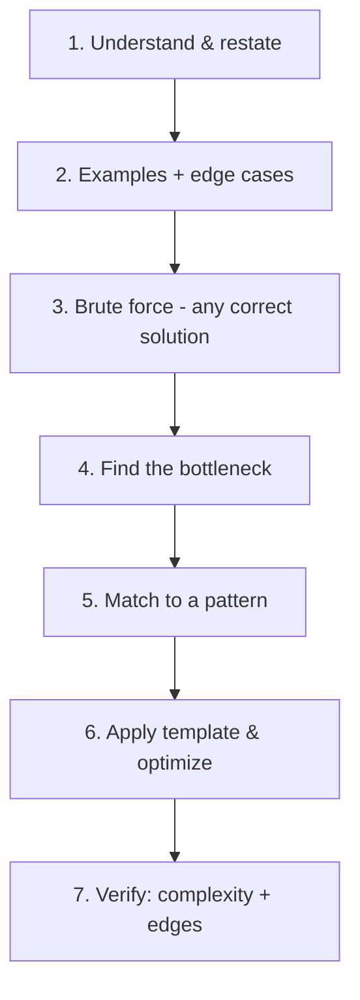

# Part I — Foundations of Problem Solving

[← Back to Table of Contents](README.md)

> Before learning *individual* patterns, you need the meta-skill: a repeatable process for attacking *any* problem and a mental model of what a "pattern" is.

---

## 1.1 What a "Pattern" Really Is

A **pattern** is a reusable *problem-solving strategy* — a mapping from a **class of problem structures** to an **efficient technique**. It is more abstract than an algorithm and more concrete than "be clever."

Think of three levels:

```
Concept        →   Pattern              →   Algorithm/Code
"find a pair"      "two converging        "two pointers on a
                    pointers on sorted"     sorted array"
```

- An **algorithm** is a specific procedure (e.g., binary search).
- A **pattern** is the *recognition rule* + a *family of algorithms* it unlocks (e.g., "monotonic answer space → binary search on the answer").

💡 **Patterns are compression.** Instead of remembering 10,000 problems, you remember ~25 patterns and the *signals* that trigger them. New problems become "oh, this is a sliding-window problem in disguise."

### Why patterns beat memorization
- **Transfer:** a pattern learned on one problem solves dozens of unseen ones.
- **Speed:** recognizing the pattern is 80% of the solution; coding is the easy 20%.
- **Confidence under pressure:** you have a starting move instead of a blank page.

---

## 1.2 The Universal Problem-Solving Framework

Run this loop on **every** problem. It prevents the two failure modes: freezing (no idea) and flailing (coding the wrong thing).



**1. Understand & restate.** Put the problem in your own words. Identify inputs, outputs, and constraints. Ask clarifying questions: duplicates allowed? sorted? value ranges? in-place required?

**2. Examples & edge cases.** Hand-trace a small example. List edge cases *now*: empty, single element, all equal, negatives, overflow, already-sorted.

**3. Brute force first.** Find *any* correct solution, even O(2ⁿ). It guarantees you understand the problem and exposes the structure to optimize.

**4. Find the bottleneck.** Where does time go? Repeated scanning? Recomputation? Redundant search? The bottleneck *names* the pattern you need.

**5. Match to a pattern.** Use the signal tables ([Part IV](04_Pattern_Recognition.md)). The bottleneck → the fix:
- repeated "have I seen X?" → hashing
- re-scanning overlapping windows → sliding window
- recomputed subproblems → DP
- linear search in sorted data → binary search

**6. Apply the template & optimize.** Adapt the pattern's skeleton to the specifics.

**7. Verify.** Re-check edge cases, state time/space complexity, dry-run once more.

---

## 1.3 Reading Constraints → Guessing the Complexity

The single most useful interview trick: **the input size tells you the intended complexity, which narrows the pattern.**

| Constraint on n | Target complexity | Likely pattern family |
|---|---|---|
| n ≤ 10–12 | O(n!) | permutations, backtracking |
| n ≤ 20–25 | O(2ⁿ) | subsets, bitmask DP, meet-in-the-middle |
| n ≤ 100–500 | O(n³) | DP, Floyd–Warshall |
| n ≤ 2,000–10⁴ | O(n²) | DP, nested two-pointer |
| n ≤ 10⁵–10⁶ | O(n log n) / O(n) | sorting, sliding window, two pointers, heap |
| n ≤ 10⁷–10⁸ | O(n) | linear scan, prefix sums, hashing |
| n up to 10¹⁸ | O(log n) / O(1) | binary search on answer, math, fast exponentiation |

💡 If `n ≤ 10⁵` and brute force is O(n²) ≈ 10¹⁰ (too slow), the intended solution is almost certainly **O(n log n)** — think sorting, heap, or binary search; or **O(n)** — think sliding window, two pointers, or hashing.

⚠️ Also read *value* constraints, not just *count*: small value ranges hint at counting sort / bucketing / bitset; large values hint at coordinate compression.

---

## 1.4 Brute Force → Optimized: The Evolution Ladder

Optimal solutions are *evolved*, not summoned. The recurring upgrades:

| Brute-force bottleneck | Optimization | Pattern |
|---|---|---|
| Re-search "is X present?" | store seen in a set | **Hashing** |
| Recompute overlapping subarray sums | incremental window | **Sliding Window** |
| Recompute the same recursion | cache results | **DP / Memoization** |
| Linear search in sorted data | halve the space | **Binary Search** |
| Re-find min/max repeatedly | keep a heap | **Top-K / Heap** |
| Re-check "connected?" | merge sets | **Union-Find** |
| Nested loops over pairs in sorted data | converging indices | **Two Pointers** |
| Re-find next-greater element | maintain a stack | **Monotonic Stack** |

**Worked evolution — Two Sum:**
1. Brute force: try all pairs → O(n²).
2. Bottleneck: for each `x`, we re-scan for `target − x`.
3. Fix: remember values in a hash map → O(1) lookup.
4. Result: **O(n)**. *Pattern learned: "repeated search → hashing."*

This ladder — *brute force → name the bottleneck → apply the matching pattern* — is the heart of this book.

---

## 1.5 The Mental Toolkit

Four ideas appear across nearly every pattern:

### Invariants
A property that stays true on every iteration. Designing the invariant *is* designing the algorithm.
- Two pointers: "everything left of `slow` is already processed."
- Binary search: "the answer is always within `[lo, hi]`."
- Sliding window: "the window `[l, r]` always satisfies the constraint."

💡 If you can state and maintain the invariant, correctness follows almost automatically.

### State
What minimal information uniquely describes a subproblem? Choosing the right **state** is the crux of DP and backtracking.
- DP: `dp[i]` = best answer for prefix of length `i`.
- Backtracking: the partial solution built so far + remaining choices.

### Transition
How do you move from one state to the next (and combine results)?
- DP recurrence: `dp[i] = f(dp[i-1], dp[i-2], …)`.
- Graph: from node `u`, transition to each neighbor `v`.

### Monotonicity
A quantity that only increases or only decreases unlocks powerful tools.
- Sorted/monotonic data → **binary search**, **two pointers**.
- Monotonic stack/deque → next-greater, sliding-window max.

---

## 1.6 How to Practice Patterns Effectively

1. **One pattern at a time.** Don't shuffle randomly. Do 5–10 problems of the *same* pattern back-to-back until recognition is automatic.
2. **Implement the template from memory.** If you can't reproduce the skeleton without looking, you don't own it yet.
3. **After each problem, name the pattern out loud** and add it to a personal log: *"This was a dynamic sliding window because we needed the longest substring under a constraint."*
4. **Re-derive, don't re-read.** Spaced repetition: revisit a problem days later and solve it fresh.
5. **Study your mistakes.** Keep a "traps" list (off-by-one, min vs max heap, empty input). Review it before contests/interviews.
6. **Explain to someone (or rubber-duck).** Teaching forces clarity and exposes gaps.

> 💡 **Target:** after ~150 deliberate problems organized by pattern, you'll recognize the right approach for most new problems within seconds.

---

## Key Takeaways
- A **pattern** = recognition rule + technique family; it compresses thousands of problems into ~25 ideas.
- Run the **7-step framework** on every problem; never code before step 5.
- **Constraints reveal the target complexity**, which narrows the pattern.
- Optimal solutions **evolve** from brute force by naming and fixing the bottleneck.
- Master **invariants, state, transitions, monotonicity** — they recur everywhere.

---

*Next →* [Part II: Core Patterns](02_Core_Patterns.md)
