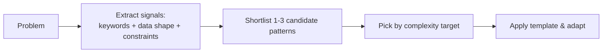

# Part IV — Pattern Recognition Techniques

[← Back to Table of Contents](README.md)

> This is the heart of the book: turning a problem statement into the right pattern in seconds. Pattern recognition is a *trainable* skill built on three inputs — **keywords**, **structure**, and **constraints**.

---

## 4.1 The Recognition Pipeline

For every problem, scan three channels in parallel:
1. **Keywords** — the verbs and nouns ("contiguous," "all permutations," "shortest path").
2. **Data shape** — array? sorted? tree? graph? intervals? linked list? strings?
3. **Constraints** — `n`'s magnitude tells you the allowed complexity.

Then shortlist patterns and disambiguate.

---

## 4.2 Signal → Pattern Lookup (Keywords)

| If you see / the problem says… | Strong candidate pattern |
|---|---|
| "sorted array" + "pair/triplet/sum" | **Two Pointers** |
| "contiguous subarray / substring" | **Sliding Window** / Prefix Sum |
| "window of size k" | **Sliding Window** (fixed) |
| "longest/shortest substring with condition" | **Sliding Window** (dynamic) |
| "range sum" / "subarray sums to K" | **Prefix Sum** (+ hashmap) |
| "many range updates then read" | **Difference Array** |
| "sorted" + "search / find boundary" | **Binary Search** |
| "min value such that…" / "minimize the maximum" | **Binary Search on Answer** |
| "seen before / duplicate / count / frequency" | **Hashing** |
| "all subsets / permutations / combinations" | **Backtracking / Subsets** |
| "all valid configurations / placements" | **Backtracking** |
| "number of ways / min cost / longest" + choices | **Dynamic Programming** |
| "maximum/minimum number of …" + sortable | **Greedy** |
| "shortest path, unweighted / fewest steps" | **BFS** |
| "shortest path, weighted, non-negative" | **Dijkstra** |
| "negative weights / detect negative cycle" | **Bellman-Ford** |
| "dependencies / prerequisites / build order" | **Topological Sort** |
| "connected / groups / merge / provinces" | **Union-Find** / DFS |
| "K largest / smallest / closest / most frequent" | **Heap (Top-K)** |
| "merge K sorted …" | **K-way Merge (heap)** |
| "median of a stream" | **Two Heaps** |
| "prefix / autocomplete / dictionary / startsWith" | **Trie** |
| "next greater / smaller element / span / histogram" | **Monotonic Stack** |
| "max/min in each window of size k" | **Monotonic Deque** |
| "linked list cycle / middle" | **Fast & Slow Pointers** |
| "reverse linked list / in groups" | **In-place Reversal** |
| "overlapping intervals / meetings / merge ranges" | **Merge Intervals** |
| "numbers in range 1..n, find missing/duplicate" | **Cyclic Sort** |
| "XOR / single number / count bits / power of two" | **Bit Manipulation** |
| "matching brackets / nested / undo" | **Stack** |

---

## 4.3 Data Shape → Pattern

| Data shape | Likely patterns |
|---|---|
| **Sorted array** | binary search, two pointers |
| **Unsorted array** | hashing; sort first to unlock two-pointer/greedy |
| **Array, numbers 1..n** | cyclic sort |
| **Contiguous subarray asked** | sliding window, prefix sum, Kadane (DP) |
| **Linked list** | fast & slow pointers, in-place reversal, dummy node |
| **Tree** | DFS (subtree/path), BFS (levels) |
| **Graph** | BFS/DFS, Dijkstra, topo sort, union-find, MST |
| **Grid/matrix** | BFS/DFS flood fill, DP (paths) |
| **Intervals** | sort + merge/sweep, heap |
| **Strings (prefix)** | trie |
| **Two strings** | 2-D DP (LCS, edit distance) |
| **Stream of data** | heap / two heaps / running aggregate |
| **Choices with overlap** | dynamic programming |
| **≤ ~20 elements** | backtracking / bitmask |

---

## 4.4 Constraints → Complexity → Pattern

| n | Budget | Pattern shortlist |
|---|---|---|
| ≤ 12 | O(n!) | permutations, backtracking |
| ≤ 20 | O(2ⁿ) | subsets, bitmask DP, meet-in-the-middle |
| ≤ 100–500 | O(n³) | interval DP, Floyd–Warshall |
| ≤ 10⁴ | O(n²) | 2-D DP, nested two-pointer |
| ≤ 10⁵–10⁶ | O(n log n)/O(n) | sort, heap, binary search, sliding window, two pointers |
| ≤ 10⁸ | O(n)/O(log n) | linear scan, prefix sum, hashing, math |
| up to 10¹⁸ | O(log n)/O(1) | binary search on answer, fast exponentiation, math |

💡 Workflow: estimate brute-force cost → compare to ~10⁸ ops/sec → the required speedup names the pattern. Brute force O(n²) at n=10⁵ is 10¹⁰ (too slow) ⇒ you need O(n log n) or O(n).

---

## 4.5 Disambiguating Similar Patterns

Patterns that look alike but aren't:

| Confusion | Pick this one when… |
|---|---|
| **Sliding Window vs Two Pointers** | Window → *contiguous* aggregate under a constraint. Two pointers → converging on sorted data / pairs / in-place. |
| **Prefix Sum vs Sliding Window** | Prefix sum → arbitrary range queries, can handle negatives & "sum == K". Sliding window → monotonic growth/shrink (often needs non-negative values). |
| **BFS vs DFS** | BFS → *shortest*/level/min-steps (unweighted). DFS → existence, components, cycles, topo, backtracking. |
| **BFS vs Dijkstra** | Edges unweighted/equal → BFS. Weighted (non-negative) → Dijkstra. |
| **Greedy vs DP** | Greedy → local choice provably global (prove it!). DP → must consider multiple choices with overlap. |
| **Backtracking vs DP** | Need *all* solutions/arrangements → backtracking. Need a *count/optimum* with overlapping subproblems → DP. |
| **Heap vs Sorting** | Need only top-K or a stream → heap (O(n log k)). Need full order once → sort (O(n log n)). |
| **Union-Find vs DFS (components)** | Dynamic/streaming unions or many "connected?" queries → DSU. One static pass → DFS/BFS. |
| **Monotonic Stack vs Deque** | Stack → next greater/smaller (one direction). Deque → extremum over a *moving window*. |
| **Hash map vs Sorting** | Need O(1) membership/counts, order irrelevant → hash. Need order/range → sort or `set`. |

---

## 4.6 Common Transformations & Reductions

The advanced skill: **rewrite** an unfamiliar problem into a familiar pattern.

| Transformation | Unlocks |
|---|---|
| **Sort the input** | two pointers, greedy, binary search, merge intervals |
| **Map values → indices** (numbers 1..n) | cyclic sort, find missing/duplicate in O(1) space |
| **Build prefix sums** | O(1) range queries, "subarray sum = K" via hashmap |
| **+1/−1 encoding** (0→−1) | "equal 0s and 1s subarray" → prefix-sum equality |
| **Binary search the answer** | "minimize the maximum / maximize the minimum" |
| **Model as a graph** | grids, word ladders, state puzzles → BFS/DFS |
| **State compression (bitmask)** | small-set DP (TSP, assignment) |
| **Coordinate compression** | large value ranges → segment tree / BIT on ranks |
| **Reverse the problem** | "min deletions to make X" ↔ "max keep that is X" (e.g., LIS) |
| **Two-pass (prefix + suffix)** | product-except-self, trapping rain water |
| **Negate weights** | "longest path in DAG" via shortest-path machinery |

**Example reduction.** "Find the contiguous subarray with equal numbers of 0s and 1s." Replace each 0 with −1; now it's "longest subarray with sum 0," solved by **prefix sums + hashmap** (first index where each prefix sum appeared). A hard-looking problem becomes a known pattern by one transformation.

---

## 4.7 A 60-Second Recognition Checklist

Ask, in order:
1. **What's the data shape?** (array / sorted / tree / graph / intervals / string / stream)
2. **What's being asked?** (search / count / optimize / enumerate / shortest / range)
3. **Is it contiguous?** → sliding window / prefix sum.
4. **Is it sorted or monotonic?** → binary search / two pointers.
5. **"All/every arrangement"?** → backtracking.
6. **"Number of ways / min-max with choices"?** → DP.
7. **Graph words (path/connected/dependency)?** → BFS/DFS/Dijkstra/topo/DSU.
8. **"Top-K / median / merge-K"?** → heap(s).
9. **"Prefix"?** → trie.
10. **Does `n` rule out my brute force?** → pick the complexity, which names the pattern.

> 💡 If two patterns fit, start with the simpler one and the constraint that distinguishes them (4.5). State your reasoning out loud in interviews — recognition *is* the signal of competence.

---

*Next →* [Part V: Interview Preparation](05_Interview_Preparation.md)
