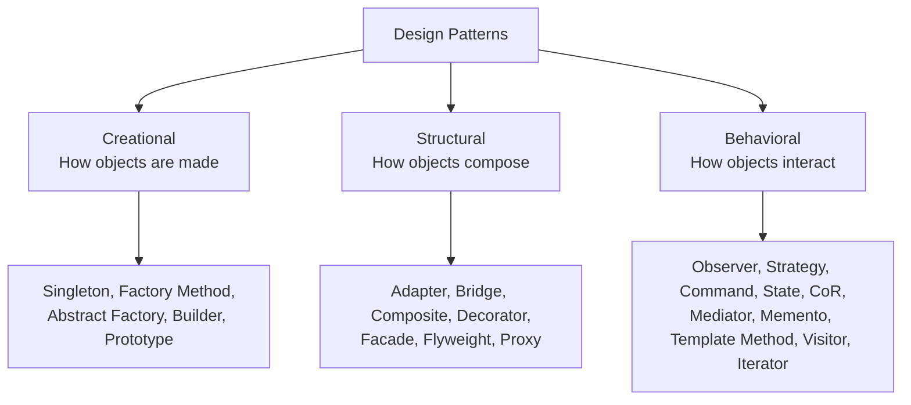

# Chapter 1 — Foundations

> Patterns are *answers*. This chapter teaches the *questions*. Without understanding the problems of naive OOP design, patterns look like arbitrary boilerplate. With it, they look inevitable.

---

## 1.1 What Is a Design Pattern?

A **design pattern** is a *named, reusable solution to a recurring design problem* within a given context. It is **not**:

- a finished piece of code you paste in,
- a library or framework,
- a silver bullet.

It **is**:

- a *vocabulary* ("let's use an Observer here") that lets engineers communicate intent in two words instead of two paragraphs,
- a *template* for how classes and objects collaborate,
- a *distillation of experience* — solutions that experienced designers reinvented so many times they were finally catalogued.

> **Key mental model:** A pattern describes a **relationship between roles**, not specific classes. "Subject notifies Observers" is the pattern; `TemperatureSensor notifies Display` is one instance of it.

---

## 1.2 A Short History (GoF)

In 1994, four authors — Erich Gamma, Richard Helm, Ralph Johnson, and John Vlissides (the **"Gang of Four"**, GoF) — published *Design Patterns: Elements of Reusable Object-Oriented Software*. They catalogued **23 patterns** in three families:

- **Creational** — how objects are *created*.
- **Structural** — how objects are *composed* into larger structures.
- **Behavioral** — how objects *interact and distribute responsibility*.

The idea was borrowed from architect **Christopher Alexander**, who described patterns for designing buildings and towns. The insight transferred: good design has *recurring structure*, and naming that structure makes it teachable.

---

## 1.3 The Naive OOP Problems Patterns Solve

Every pattern exists because a "straightforward" object-oriented design eventually breaks. The recurring pains:

| Problem | Symptom | Pattern family that helps |
|---|---|---|
| **Rigid object creation** | `new ConcreteThing()` scattered everywhere; changing the type means editing 50 files | Creational |
| **Tight coupling** | Class A knows the concrete class of B, C, D — changing one ripples everywhere | Structural / Behavioral |
| **Inheritance explosion** | `RedRoundButtonWithShadow`, `BlueSquareButtonNoShadow` … combinatorial subclasses | Decorator, Bridge, Strategy |
| **Conditional sprawl** | Giant `switch`/`if-else` on a "type" field, repeated in many methods | Strategy, State, Visitor |
| **Hard-to-change algorithms** | Behavior is hardwired into a class; can't swap at runtime | Strategy, Template Method |
| **Fragile cross-object communication** | Objects directly call each other; spaghetti dependencies | Observer, Mediator |
| **Uncontrolled access / lifetime** | Need to lazy-load, cache, guard, or log access to an object | Proxy, Flyweight |

> **The unifying theme:** *Manage change.* Patterns isolate "the part that varies" from "the part that stays the same," so that change is local instead of global.

---

## 1.4 OOP Fundamentals Refresher

Patterns lean on four pillars. Make sure these are solid.

### Abstraction
Expose *what* an object does, hide *how*. An interface (`Shape::area()`) is an abstraction; the implementation is hidden.

### Encapsulation
Bundle data with the operations on it, and restrict direct access to internals. Encapsulation is what makes it *safe* to change implementation without breaking callers.

### Inheritance
Model an **"is-a"** relationship and reuse/extend behavior. Powerful but easily abused (see §1.6).

### Polymorphism
One interface, many behaviors. The caller talks to a base type; the actual derived object decides what happens at runtime. **This is the engine behind almost every behavioral and structural pattern.**

```cpp
struct Shape { virtual double area() const = 0; virtual ~Shape() = default; };
struct Circle : Shape { double r; double area() const override { return 3.14159 * r * r; } };
struct Square : Shape { double s; double area() const override { return s * s; } };

double totalArea(const std::vector<std::unique_ptr<Shape>>& shapes) {
    double sum = 0;
    for (const auto& s : shapes) sum += s->area(); // polymorphic dispatch
    return sum;
}
```

The caller `totalArea` never knows or cares whether a shape is a circle or square. That *not caring* is the seed of every pattern.

---

## 1.5 The SOLID Principles

SOLID is the bridge between OOP and patterns. Most patterns are SOLID principles *crystallized into structure*.

### S — Single Responsibility Principle (SRP)
> A class should have only one reason to change.

A class that parses input, formats output, *and* writes to disk has three reasons to change. Split it. (Patterns: Strategy, Command, Facade.)

### O — Open/Closed Principle (OCP)
> Software entities should be open for extension, closed for modification.

You should be able to add new behavior **without editing existing, tested code**. Achieved via polymorphism: add a new subclass instead of editing a `switch`. (Patterns: Strategy, Decorator, Factory Method, Visitor.)

### L — Liskov Substitution Principle (LSP)
> Subtypes must be substitutable for their base types without breaking correctness.

If `Square` inherits `Rectangle` but breaks the assumption "width and height are independent," you've violated LSP. Patterns that rely on polymorphism *depend* on LSP holding.

### I — Interface Segregation Principle (ISP)
> Many small, specific interfaces beat one fat interface.

Don't force a `Printer` to implement `fax()` and `scan()` it doesn't support. (Patterns: Adapter, Bridge.)

### D — Dependency Inversion Principle (DIP)
> Depend on abstractions, not concretions. High-level modules shouldn't depend on low-level details.

`OrderService` should depend on an abstract `PaymentGateway`, not on `StripeApiV3`. (Patterns: Abstract Factory, Strategy, almost all of them.)

> **Interview gold:** Be able to name *which SOLID principle a pattern primarily serves*. See the [Pattern → SOLID Matrix](09-Cheatsheets.md#95-pattern--solid-matrix).

---

## 1.6 Composition over Inheritance

The single most important design heuristic behind patterns.

**Inheritance ("is-a")** is a *compile-time, permanent* relationship. A `Dog` is always an `Animal`.

**Composition ("has-a")** is a *runtime, swappable* relationship. A `Character` *has-a* `WeaponBehavior` that can change.

### Why inheritance breaks down: the combinatorial explosion

Suppose a `Coffee` can have milk, sugar, and whipped cream. With inheritance you'd need:

```
Coffee
CoffeeWithMilk
CoffeeWithSugar
CoffeeWithMilkAndSugar
CoffeeWithMilkSugarAndCream
... (2^n subclasses)
```

This is unmaintainable. **Composition** (the Decorator pattern) lets you *wrap* a coffee with a milk-adder at runtime instead. New combinations cost nothing.

```cpp
// Instead of subclassing for every behavior combo,
// the object HOLDS a behavior it can swap at runtime.
struct Duck {
    std::unique_ptr<FlyBehavior> fly;     // composition
    std::unique_ptr<QuackBehavior> quack; // composition
    void performFly()   { fly->fly(); }
    void performQuack() { quack->quack(); }
};
```

> **Rule of thumb:** Use inheritance for *interface* (shared contract) and composition for *behavior* (what can vary).

---

## 1.7 Coupling and Cohesion

- **Coupling** = how much one module depends on the internals of another. *Low coupling is good.*
- **Cohesion** = how focused a single module is on one job. *High cohesion is good.*

Patterns are, almost universally, machines for **reducing coupling** while keeping cohesion high. Observer decouples subject from observers. Mediator decouples colleagues from each other. Abstract Factory decouples client from concrete products.

---

## 1.8 Classification of Patterns



- **Creational** — decouple *what* you use from *how it's instantiated*.
- **Structural** — assemble objects into flexible, larger structures.
- **Behavioral** — assign responsibilities and define communication.

---

## 1.9 How to Choose a Pattern

Ask, in order:

1. **What varies?** Isolate it. (Creation? Structure? Algorithm? Communication?)
2. **Is the variation in *creation*?** → Creational.
3. **Is it in *structure/composition*?** → Structural.
4. **Is it in *behavior/interaction*?** → Behavioral.
5. **What's the smallest thing that solves it?** Prefer the simplest pattern — or no pattern at all.

> See the full [Pattern Selection Guide](09-Cheatsheets.md#92-pattern-selection-guide).

---

## 1.10 C++ Prerequisites

The C++ implementation layer throughout this book assumes these idioms. Skim now; refer back as needed.

### RAII (Resource Acquisition Is Initialization)
A resource's lifetime is tied to an object's lifetime. Acquire in the constructor, release in the destructor. This is *the* defining C++ idiom and underlies smart pointers, locks, files, etc.

```cpp
class FileHandle {
    std::FILE* f_;
public:
    explicit FileHandle(const char* path) : f_(std::fopen(path, "r")) {}
    ~FileHandle() { if (f_) std::fclose(f_); } // released automatically
};
```

### Smart pointers
| Smart pointer | Ownership | Use when |
|---|---|---|
| `std::unique_ptr<T>` | **Exclusive** | One owner; the default choice. Zero overhead. |
| `std::shared_ptr<T>` | **Shared (ref-counted)** | Genuinely shared ownership / unclear lifetime. Has overhead. |
| `std::weak_ptr<T>` | **Non-owning observer** | Break reference cycles (e.g., Observer back-references). |

> **Default to `unique_ptr`.** Reach for `shared_ptr` only when ownership is truly shared. Overusing `shared_ptr` hides lifetime bugs and costs atomic refcount operations.

### Copy vs Move semantics
- **Copy** duplicates the resource (deep copy). Can be expensive.
- **Move** transfers ownership (steals the guts), leaving the source empty. Cheap.
- The **Rule of Zero**: if your class manages no raw resources, write *no* special members — let the compiler generate them and let smart-pointer members handle moves correctly.

```cpp
auto p = std::make_unique<Widget>();
auto q = std::move(p); // ownership transferred; p is now null. No copy, no leak.
```

### Virtual dispatch & polymorphism
- A `virtual` function is resolved at **runtime** via the vtable.
- **Always give polymorphic base classes a `virtual` destructor**, otherwise `delete base_ptr` on a derived object is undefined behavior.
- Mark overrides with `override`; mark non-extensible classes/methods `final` to help the compiler and the reader.

```cpp
struct Base { virtual ~Base() = default; virtual void f() = 0; };
struct Derived final : Base { void f() override {} };
```

### `make_unique` / `make_shared`
Prefer them over raw `new`: exception-safe, less typing, and `make_shared` puts the control block and object in one allocation.

---

> **You now have the vocabulary.** Every pattern that follows is just a disciplined application of: *polymorphism + composition + SOLID, aimed at isolating change.*

*Next: [Chapter 2 — Creational Patterns →](02-Creational-Patterns.md)*
