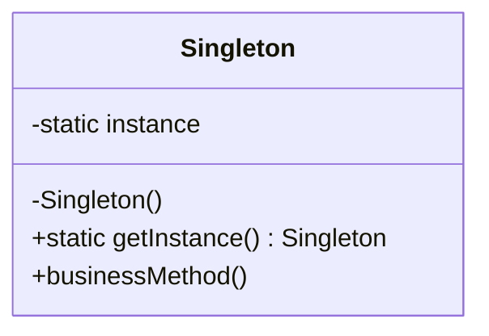
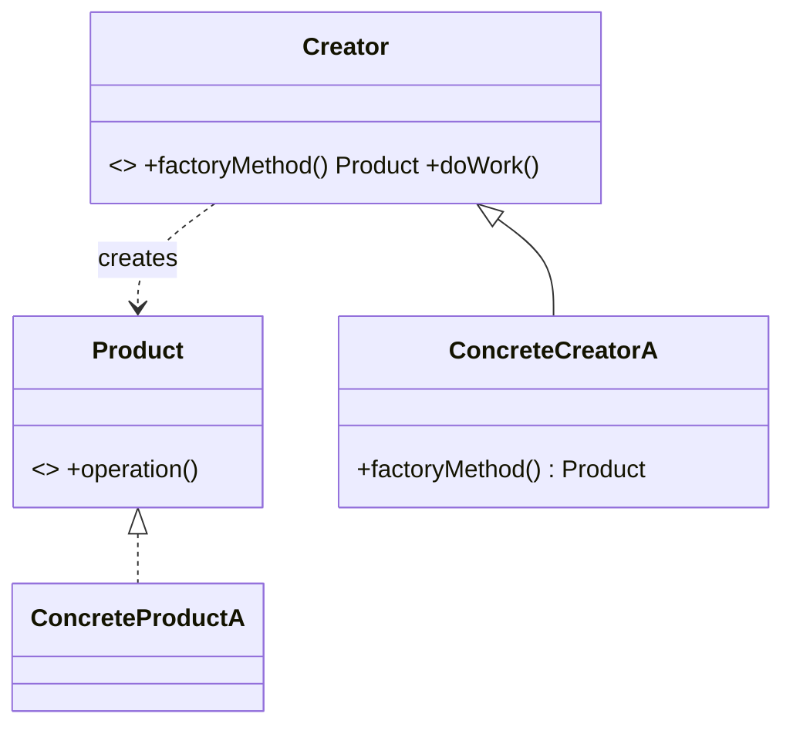
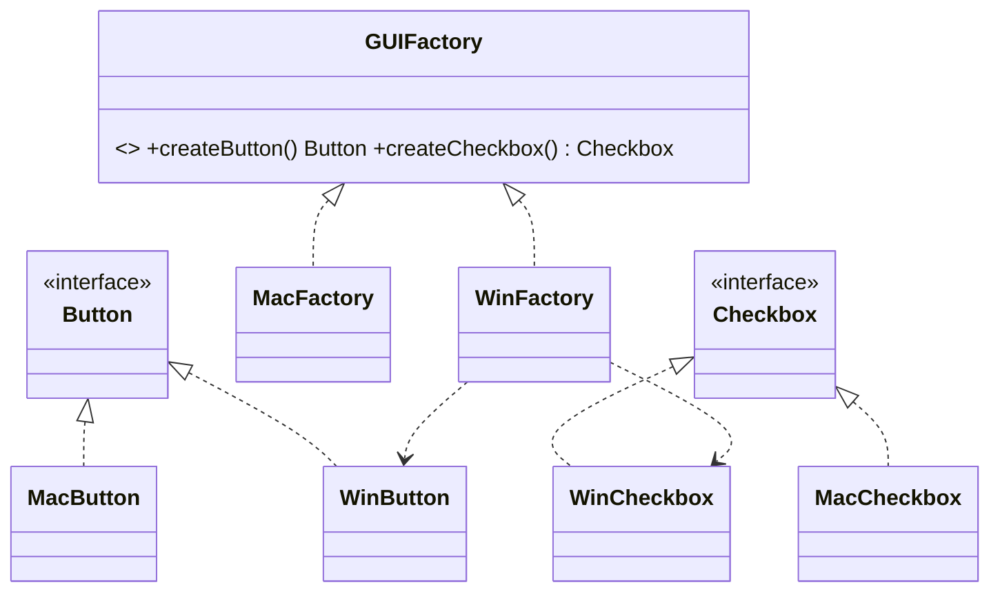

# Chapter 2 — Creational Patterns

> **Theme:** Decouple *what* a client uses from *how that thing is created*. When object creation is hardwired (`new ConcreteX()`), every change to "which concrete type" ripples through the codebase. Creational patterns make creation a *pluggable decision*.

Patterns in this chapter:
- [2.1 Singleton](#21-singleton-beginner)
- [2.2 Factory Method](#22-factory-method-beginner--intermediate)
- [2.3 Abstract Factory](#23-abstract-factory-intermediate)
- [2.4 Builder](#24-builder-intermediate)
- [2.5 Prototype](#25-prototype-intermediate)

---

## 2.1 Singleton *(Beginner)*

### 🎯 Definition
Ensure a class has **exactly one instance** and provide a **global point of access** to it.

### ❓ The Problem It Solves
Some resources are inherently singular: a configuration registry, a logging service, a hardware device handle, a thread pool. Creating multiple instances would be wrong (conflicting state) or wasteful (duplicate connections). We need a guarantee of "one and only one," reachable from anywhere.

### Background Problems in Naive Design
- Passing the same object through dozens of constructors ("dependency tunneling") is tedious.
- A plain global variable has no control over *when* it's initialized and no protection against duplication.
- Static initialization order across translation units is undefined ("static initialization order fiasco").

### 🌍 Real-World Analogy
A country has **one official government**. No matter which citizen you ask, "the government" refers to the same single entity. There's a well-known way to reach it.

### 🧩 Conceptual Structure
- **Singleton** — holds a private static reference to its sole instance; constructor is private; exposes a static `instance()` accessor.



### ⚙️ Step-by-Step Working
1. Make the constructor **private/protected** so no one else can instantiate.
2. Hold the single instance privately (static).
3. Provide a static accessor that creates-on-first-call (lazy) or returns the pre-created one.
4. Disable copying and assignment.

### ⚖️ Advantages and Tradeoffs
**Pros:** guaranteed single instance; lazy initialization possible; global access.
**Cons (important!):** it's essentially a **global variable in disguise** — hides dependencies, hurts testability (hard to mock/replace), creates hidden coupling, and complicates multithreading. Widely considered an **anti-pattern when overused** (see [Chapter 7](07-Anti-Patterns.md#72-singleton-abuse)).

### ✅ When to Use
- Exactly one instance is a genuine domain truth (hardware, OS-level resource).
- A logging or configuration service where injecting it everywhere is impractical *and* statelessness/idempotence keeps it safe.

### 🚫 When NOT to Use
- Just to have "global access" for convenience — prefer **dependency injection**.
- When you'll need multiple instances later (tests, multi-tenant, plugins).
- As a dumping ground for global mutable state.

---

### 💻 C++ Implementation

#### ❌ Bad: classic lazy Singleton with raw pointer
```cpp
class Logger {
    static Logger* instance_;
    Logger() {}
public:
    static Logger* getInstance() {
        if (!instance_) instance_ = new Logger(); // NOT thread-safe; who deletes it?
        return instance_;
    }
};
Logger* Logger::instance_ = nullptr;
```
Problems: **data race** under concurrency (two threads both see null), **memory leak** (no `delete`), copyable, and global-state coupling.

#### ✅ Improved: Meyers' Singleton (C++11+)
```cpp
class Logger {
public:
    static Logger& instance() {
        static Logger inst;   // thread-safe, lazy, destroyed at exit (C++11 guarantees)
        return inst;
    }
    void log(const std::string& msg) { /* ... */ }

    Logger(const Logger&)            = delete;  // no copies
    Logger& operator=(const Logger&) = delete;
private:
    Logger()  = default;
    ~Logger() = default;
};

// Usage:
Logger::instance().log("started");
```

### 🧠 C++ Nuances
- **Thread safety:** Since C++11, initialization of a function-local `static` is guaranteed thread-safe ("magic statics"). No manual mutex/double-checked locking needed.
- **Object lifetime:** The instance is constructed on first use and destroyed automatically at program exit, in reverse order of construction. This avoids the leak of the raw-pointer version.
- **Static initialization order fiasco:** Meyers' Singleton sidesteps it because construction happens on *first access*, not at static-init time.
- **Return by reference**, not pointer — callers can't `delete` it or check it for null.
- **Smart pointers:** generally *not* needed here; the local static owns itself. Don't wrap it in `shared_ptr`.
- **Testability fix:** depend on an interface and inject the singleton at the composition root, instead of calling `Logger::instance()` deep inside business logic.

---

## 2.2 Factory Method *(Beginner → Intermediate)*

### 🎯 Definition
Define an interface for creating an object, but let **subclasses decide which class to instantiate**. Factory Method defers instantiation to subclasses.

### ❓ The Problem It Solves
A class needs to create objects, but it shouldn't be hardcoded to a *concrete* type. Direct `new ConcreteProduct()` violates the Open/Closed Principle: adding a new product type means editing the creator.

### Background Problems in Naive Design
```cpp
// Naive: the dialog is welded to one button type.
class Dialog {
    void render() {
        WindowsButton b;   // hardwired — can't reuse for Web/Mac
        b.paint();
    }
};
```
Want a web button? You must *edit* `Dialog`. That's a modification, not an extension.

### 🌍 Real-World Analogy
A **logistics company** defines the process "deliver a package," which includes "create a transport." A *road* logistics branch creates a **Truck**; a *sea* branch creates a **Ship**. The overall process is identical; only the *kind of transport created* differs by branch.

### 🧩 Conceptual Structure
- **Product** — the interface of objects the factory creates.
- **ConcreteProduct** — specific implementations.
- **Creator** — declares the factory method (returns a Product); contains the higher-level logic that *uses* products.
- **ConcreteCreator** — overrides the factory method to return a specific ConcreteProduct.



### ⚙️ Step-by-Step Working
1. The `Creator` has business logic (`doWork`) that needs *a* Product but not a *specific* one.
2. It calls its own `factoryMethod()` to obtain one.
3. Each `ConcreteCreator` overrides `factoryMethod()` to choose the concrete product.
4. Adding a new product = add a ConcreteProduct + a ConcreteCreator. **No existing code changes.**

### ⚖️ Advantages and Tradeoffs
**Pros:** OCP-friendly; removes concrete coupling; single creation point per product family; easy to test by overriding.
**Cons:** introduces a parallel subclass hierarchy (one creator per product) — can feel heavy for simple cases. Sometimes a simple *parameterized* factory function is enough.

### ✅ When to Use
- A class can't anticipate the concrete type it must create.
- You want subclasses to specify what they create.
- You want to localize the "which type" knowledge in one overridable spot.

### 🚫 When NOT to Use
- There's only ever one product type and no foreseeable variation.
- A trivial `if/switch` factory function suffices (don't grow a hierarchy for nothing).

---

### 💻 C++ Implementation

```cpp
#include <memory>
#include <string>

// Product
struct Transport {
    virtual ~Transport() = default;
    virtual std::string deliver() const = 0;
};
struct Truck : Transport { std::string deliver() const override { return "by land"; } };
struct Ship  : Transport { std::string deliver() const override { return "by sea";  } };

// Creator
class Logistics {
public:
    virtual ~Logistics() = default;
    // The factory method:
    virtual std::unique_ptr<Transport> createTransport() const = 0;

    // Business logic that depends only on the abstract Product:
    std::string planDelivery() const {
        auto t = createTransport();
        return "Delivering " + t->deliver();
    }
};

// Concrete Creators
struct RoadLogistics : Logistics {
    std::unique_ptr<Transport> createTransport() const override {
        return std::make_unique<Truck>();
    }
};
struct SeaLogistics : Logistics {
    std::unique_ptr<Transport> createTransport() const override {
        return std::make_unique<Ship>();
    }
};

// Usage:
// std::unique_ptr<Logistics> l = std::make_unique<SeaLogistics>();
// l->planDelivery();  ->  "Delivering by sea"
```

### 🧠 C++ Nuances
- **Return `std::unique_ptr<Product>`**, not a raw `Product*`. This makes ownership explicit — the caller owns the new object and it's freed automatically.
- **Covariant return types** exist in C++ (an override may return a more-derived *raw pointer/reference*), but they **don't work with `unique_ptr`**. So keep the return type `unique_ptr<Transport>` in all overrides.
- **Virtual destructor** on `Transport` is mandatory — clients hold `unique_ptr<Transport>` and destroy through the base.
- **Performance:** one heap allocation per product + one virtual call. Negligible for most code; if it's hot, consider object pools or value-based variants.
- **Modern alternative:** a factory that takes a `std::function<std::unique_ptr<Transport>()>` registry (a *registration* factory) avoids subclassing the creator entirely.

---

## 2.3 Abstract Factory *(Intermediate)*

### 🎯 Definition
Provide an interface for creating **families of related objects** without specifying their concrete classes.

### ❓ The Problem It Solves
Sometimes products come in *matched sets* that must be used together. A GUI toolkit's `Windows` family has `WindowsButton` + `WindowsCheckbox` + `WindowsScrollbar`; the `macOS` family has its own matching trio. You must avoid mixing a Windows button with a macOS checkbox.

### Background Problems in Naive Design
Scattering `new WindowsButton()`, `new WindowsCheckbox()` across the app means switching to macOS requires editing every creation site — and risks mismatched families.

### 🌍 Real-World Analogy
A **furniture company** offers themed collections: *Victorian*, *Modern*, *ArtDeco*. Each collection has a matching chair, sofa, and table. When you order "Modern," you get a *consistent set*. You never end up with a Victorian chair next to a Modern sofa.

### 🧩 Conceptual Structure
- **AbstractFactory** — declares creation methods for each abstract product (`createButton`, `createCheckbox`).
- **ConcreteFactory** — produces one consistent family.
- **AbstractProduct** — interface per product kind.
- **ConcreteProduct** — family-specific implementations.
- **Client** — uses only abstract factory + abstract products.



### ⚙️ Step-by-Step Working
1. Define an abstract interface per product (`Button`, `Checkbox`).
2. Define an `AbstractFactory` with a creator per product.
3. Each `ConcreteFactory` returns a *consistent* family.
4. The client receives one factory (chosen once, e.g., from config) and asks it for products. The whole UI is now themed consistently, and the client never names a concrete class.

### ⚖️ Advantages and Tradeoffs
**Pros:** guarantees product compatibility within a family; isolates concrete classes; swapping the whole family is a one-line change (pick a different factory).
**Cons:** adding a *new kind of product* (say `Slider`) means changing the abstract factory and **every** concrete factory — a known rigidity. Lots of interfaces/classes.

### ✅ When to Use
- Your system must be independent of how its products are created and must work with *multiple families*.
- Products in a family are designed to be used together and you must enforce that.

### 🚫 When NOT to Use
- Only one family exists.
- The set of product *kinds* changes frequently (the pattern punishes adding new product types).

---

### 💻 C++ Implementation

```cpp
#include <memory>
#include <string>

// Abstract products
struct Button   { virtual ~Button()   = default; virtual std::string paint() const = 0; };
struct Checkbox { virtual ~Checkbox() = default; virtual std::string paint() const = 0; };

// Concrete products — Windows family
struct WinButton   : Button   { std::string paint() const override { return "[Win Button]";   } };
struct WinCheckbox : Checkbox { std::string paint() const override { return "[Win Checkbox]"; } };
// Concrete products — Mac family
struct MacButton   : Button   { std::string paint() const override { return "(Mac Button)";   } };
struct MacCheckbox : Checkbox { std::string paint() const override { return "(Mac Checkbox)"; } };

// Abstract factory
struct GUIFactory {
    virtual ~GUIFactory() = default;
    virtual std::unique_ptr<Button>   createButton()   const = 0;
    virtual std::unique_ptr<Checkbox> createCheckbox() const = 0;
};

// Concrete factories
struct WinFactory : GUIFactory {
    std::unique_ptr<Button>   createButton()   const override { return std::make_unique<WinButton>(); }
    std::unique_ptr<Checkbox> createCheckbox() const override { return std::make_unique<WinCheckbox>(); }
};
struct MacFactory : GUIFactory {
    std::unique_ptr<Button>   createButton()   const override { return std::make_unique<MacButton>(); }
    std::unique_ptr<Checkbox> createCheckbox() const override { return std::make_unique<MacCheckbox>(); }
};

// Client depends only on abstractions:
class Application {
    std::unique_ptr<Button>   button_;
    std::unique_ptr<Checkbox> checkbox_;
public:
    explicit Application(const GUIFactory& f)
        : button_(f.createButton()), checkbox_(f.createCheckbox()) {}
    std::string render() const { return button_->paint() + " " + checkbox_->paint(); }
};

// Usage:
// WinFactory f; Application app(f); app.render(); // consistent Windows widgets
```

### 🧠 C++ Nuances
- **Family consistency** is enforced at compile-and-construction time: a `WinFactory` *cannot* hand you a `MacCheckbox`.
- The factory is passed by **`const&`** — the `Application` doesn't own the factory, only the products it created.
- **Lifetime:** products are `unique_ptr` members of the client; they live exactly as long as the `Application`.
- **Templates as an alternative:** for compile-time family selection you can use a *policy/traits* approach (`template <class Factory>`), trading runtime flexibility for zero virtual overhead. Use templates when the family is known at compile time; use virtual factories when it's chosen at runtime (config/CLI).

---

## 2.4 Builder *(Intermediate)*

### 🎯 Definition
Separate the **construction** of a complex object from its **representation**, so the same construction process can create different representations — and so objects with many optional parts can be built step by step.

### ❓ The Problem It Solves
Two related pains:
1. **Telescoping constructors:** `House(int, int, bool, bool, int, std::string, bool, ...)` — unreadable, error-prone, many optional params.
2. **Complex assembly:** an object needs a multi-step, ordered construction (parse → validate → assemble), and you want to reuse that process for different outputs (e.g., build an HTML doc vs a PDF doc from the same steps).

### Background Problems in Naive Design
```cpp
// Telescoping constructor hell:
Pizza(int size, bool cheese, bool pepperoni, bool mushroom,
      bool olives, bool onion, std::string crust); // which bool was which?!
Pizza p(12, true, false, true, false, true, "thin"); // unreadable
```

### 🌍 Real-World Analogy
Ordering a **custom sandwich at a deli**: you direct the worker step by step ("wheat bread, add turkey, add lettuce, no onions"). The *worker* (builder) knows how to assemble; you (the director/client) specify the steps. The same worker can build many different sandwiches.

### 🧩 Conceptual Structure
- **Builder** — abstract interface with step methods (`addCheese`, `setCrust`).
- **ConcreteBuilder** — implements steps, keeps the part-built product, exposes `getResult()`.
- **Director** *(optional)* — encapsulates a *recipe* (a fixed sequence of steps) for common configurations.
- **Product** — the complex object.

### ⚙️ Step-by-Step Working
1. Client creates a ConcreteBuilder.
2. Client (or a Director) calls step methods in sequence, each configuring one part.
3. Steps can be optional and in any order — only what's needed is called.
4. Client retrieves the finished product via `getResult()`.

### ⚖️ Advantages and Tradeoffs
**Pros:** readable construction; supports immutable products (build then freeze); reuses the construction process; isolates complex assembly. **Fluent interface** (method chaining) reads like prose.
**Cons:** more code than a constructor; only worthwhile when the object is genuinely complex or has many optional fields.

### ✅ When to Use
- Many optional parameters / configuration combinations.
- The object should be immutable once built.
- Construction is multi-step or must be reusable for different representations.

### 🚫 When NOT to Use
- The object has a few fields — a constructor or aggregate initialization is clearer.

---

### 💻 C++ Implementation

#### ❌ Bad: telescoping constructor
```cpp
struct HttpRequest {
    HttpRequest(std::string url, std::string method, std::string body,
                int timeout, bool keepAlive, bool followRedirects); // unreadable call sites
};
```

#### ✅ Improved: fluent Builder producing an immutable product
```cpp
#include <string>
#include <map>

class HttpRequest {                  // immutable product
public:
    const std::string url, method, body;
    const int timeout;
    const std::map<std::string,std::string> headers;
private:
    HttpRequest(std::string u, std::string m, std::string b, int t,
                std::map<std::string,std::string> h)
        : url(std::move(u)), method(std::move(m)), body(std::move(b)),
          timeout(t), headers(std::move(h)) {}
    friend class HttpRequestBuilder;
};

class HttpRequestBuilder {
    std::string url_, method_{"GET"}, body_;
    int timeout_{30};
    std::map<std::string,std::string> headers_;
public:
    explicit HttpRequestBuilder(std::string url) : url_(std::move(url)) {}

    HttpRequestBuilder& method(std::string m)              { method_ = std::move(m); return *this; }
    HttpRequestBuilder& body(std::string b)                { body_   = std::move(b); return *this; }
    HttpRequestBuilder& timeout(int seconds)               { timeout_ = seconds;     return *this; }
    HttpRequestBuilder& header(std::string k, std::string v){ headers_[std::move(k)] = std::move(v); return *this; }

    HttpRequest build() const {
        return HttpRequest(url_, method_, body_, timeout_, headers_);
    }
};

// Usage — reads like prose:
// auto req = HttpRequestBuilder("https://api.example.com")
//                .method("POST")
//                .header("Content-Type", "application/json")
//                .body("{\"x\":1}")
//                .timeout(10)
//                .build();
```

### 🧠 C++ Nuances
- **`return *this;`** from each setter enables the **fluent interface** (method chaining).
- **Move semantics:** setters take parameters **by value and `std::move`** them in — this is the modern, efficient idiom (works well for both lvalues and rvalues, one copy/move total).
- **Immutability:** the product's fields are `const`; only the friend builder can construct it. Construction is the *only* time mutation happens.
- **Rvalue-ref-qualified builders:** advanced builders overload setters on `&&` to allow moving the builder's internals straight into the product, avoiding a final copy.
- **Object lifetime:** `build()` returns a value (RVO/move) — no heap allocation needed; the product can live on the stack.
- **Named Parameter Idiom:** the C++ community name for "use a builder to simulate named arguments."

---

## 2.5 Prototype *(Intermediate)*

### 🎯 Definition
Create new objects by **cloning an existing instance** (the prototype) rather than constructing from scratch.

### ❓ The Problem It Solves
Sometimes you have a fully-configured object and need many copies of it, but:
- you don't know its concrete class (you hold a base pointer), or
- constructing fresh is expensive (heavy initialization, DB load), or
- you want to snapshot a runtime-configured object.

You can't just call the constructor — you don't know which one, or it's costly. So you ask the object to **copy itself**.

### Background Problems in Naive Design
A client holding `Shape*` wants a copy. `new Shape(*ptr)` slices to the base type and loses the derived part. The client would need a giant `if (dynamic_cast<Circle*>(p)) new Circle(...)` — coupling and fragility.

### 🌍 Real-World Analogy
**Biological cell division:** a cell produces a copy of itself without an external "constructor." Or a **document template**: you duplicate a configured template and tweak the copy, instead of rebuilding the formatting every time.

### 🧩 Conceptual Structure
- **Prototype** — declares a `clone()` method.
- **ConcretePrototype** — implements `clone()` to copy itself (returning the correct dynamic type).
- **Client** — produces new objects by calling `clone()` on a prototype it holds.

### ⚙️ Step-by-Step Working
1. Each class implements `clone()` returning a copy of itself as the base type.
2. The client keeps one or more prototype instances (often in a registry).
3. To get a new object, the client clones a prototype and optionally tweaks it.
4. The client never names a concrete class — `clone()` returns the right type polymorphically.

### ⚖️ Advantages and Tradeoffs
**Pros:** clone without knowing concrete types; cheaper than expensive construction; snapshot runtime state; build a registry of pre-configured prototypes.
**Cons:** **deep vs shallow copy** is tricky — cloning objects with pointers, cycles, or shared resources is error-prone. Every class must implement `clone()`.

### ✅ When to Use
- You need copies of objects whose concrete type is hidden behind an interface.
- Construction is expensive and copying is cheaper.
- You want to avoid a parallel factory hierarchy and instead just clone exemplars.

### 🚫 When NOT to Use
- Objects are simple to construct directly.
- Objects have complex shared/cyclic ownership where cloning semantics are ambiguous.

---

### 💻 C++ Implementation

```cpp
#include <memory>
#include <string>
#include <unordered_map>

// Prototype
struct Shape {
    virtual ~Shape() = default;
    virtual std::unique_ptr<Shape> clone() const = 0;   // the prototype method
    virtual std::string name() const = 0;
};

// Concrete prototypes — each clones to its OWN dynamic type
struct Circle : Shape {
    int radius{};
    explicit Circle(int r) : radius(r) {}
    std::unique_ptr<Shape> clone() const override {
        return std::make_unique<Circle>(*this);          // copy-construct self
    }
    std::string name() const override { return "Circle(r=" + std::to_string(radius) + ")"; }
};
struct Rectangle : Shape {
    int w{}, h{};
    Rectangle(int w_, int h_) : w(w_), h(h_) {}
    std::unique_ptr<Shape> clone() const override {
        return std::make_unique<Rectangle>(*this);
    }
    std::string name() const override { return "Rect"; }
};

// Optional: a prototype registry
class ShapeRegistry {
    std::unordered_map<std::string, std::unique_ptr<Shape>> prototypes_;
public:
    void registerProto(const std::string& key, std::unique_ptr<Shape> proto) {
        prototypes_[key] = std::move(proto);
    }
    std::unique_ptr<Shape> create(const std::string& key) const {
        return prototypes_.at(key)->clone();             // clone, don't construct
    }
};

// Usage:
// ShapeRegistry r;
// r.registerProto("small-circle", std::make_unique<Circle>(2));
// auto s = r.create("small-circle");   // a fresh Circle(r=2)
```

### 🧠 C++ Nuances
- **`clone()` returns `unique_ptr<Shape>`** — the *virtual constructor* idiom. This is the canonical C++ way to copy a polymorphic object you only hold by base pointer (a plain copy ctor would **slice**).
- **`std::make_unique<Circle>(*this)`** invokes `Circle`'s **copy constructor** — so the Rule of Zero gives you a correct deep-ish copy of value members for free.
- **Deep vs shallow:** if a class holds raw pointers or `shared_ptr` to mutable sub-objects, the default copy is *shallow* (shares them). For a true deep clone you must clone sub-objects recursively. **`unique_ptr` members are non-copyable**, so a class holding `unique_ptr` members must hand-write its copy/clone to deep-copy them.
- **Covariant returns:** with raw pointers you could declare `Circle* clone() const override`, but with `unique_ptr` you must keep the base return type.
- **Performance:** cloning copies value state — cheaper than re-running heavy constructors, but watch out for large owned buffers.

---

### Creational Patterns — Quick Recap

| Pattern | One-liner | Key force |
|---|---|---|
| Singleton | One instance, global access | Control instantiation count |
| Factory Method | Subclass decides which product | Defer instantiation, OCP |
| Abstract Factory | Create matching *families* | Family consistency |
| Builder | Step-by-step construction of complex objects | Readability + immutability |
| Prototype | Clone an exemplar | Copy without knowing concrete type |

> Compare Factory Method vs Abstract Factory in [Chapter 5.1](05-Pattern-Comparisons.md#51-factory-method-vs-abstract-factory).

*Next: [Chapter 3 — Structural Patterns →](03-Structural-Patterns.md)*
