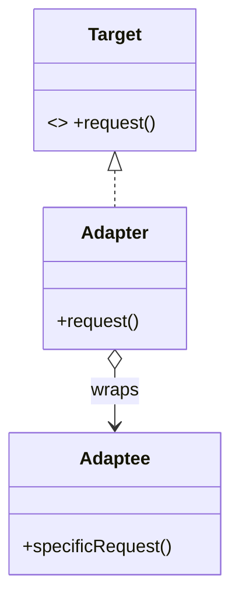
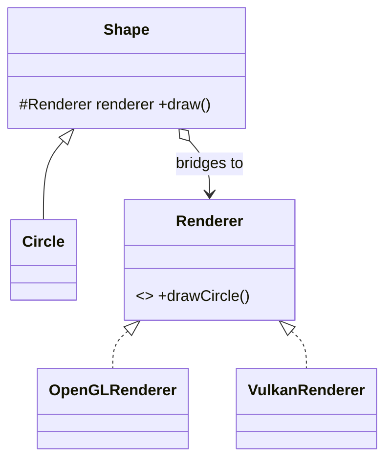
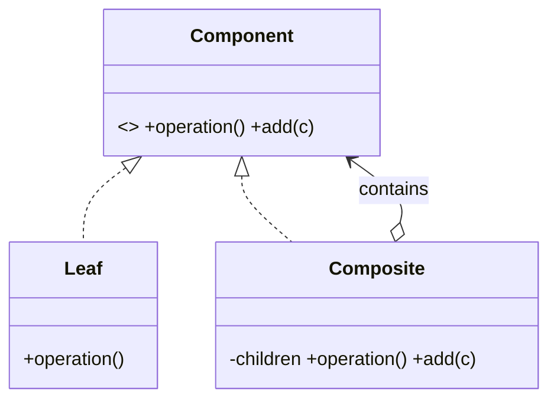
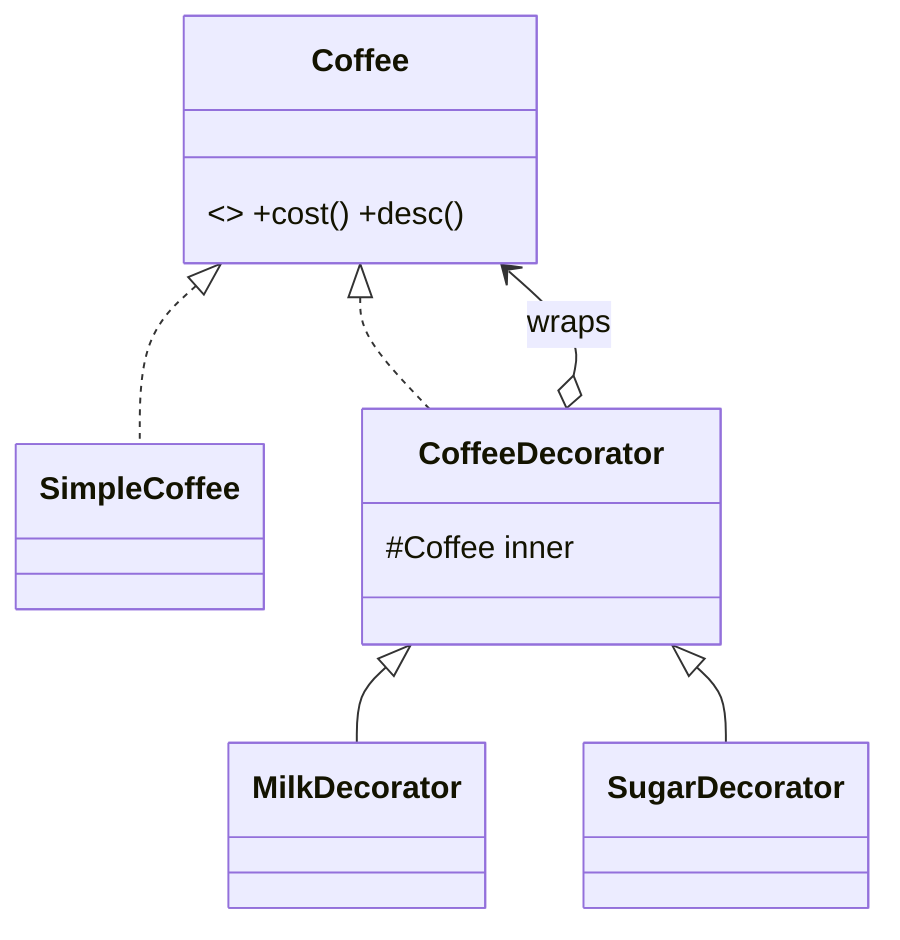
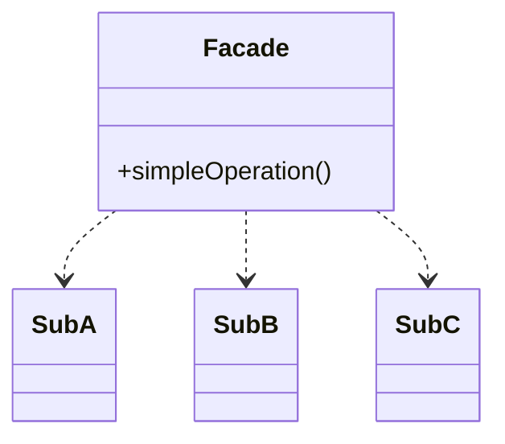
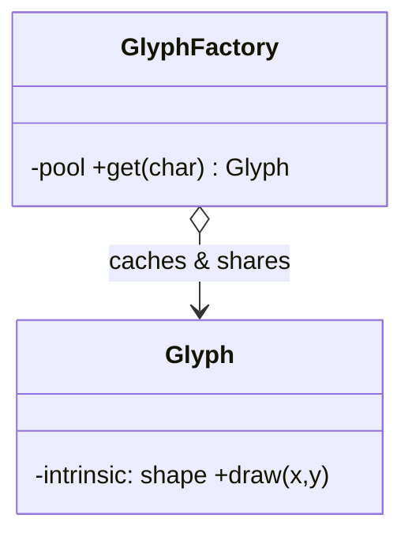
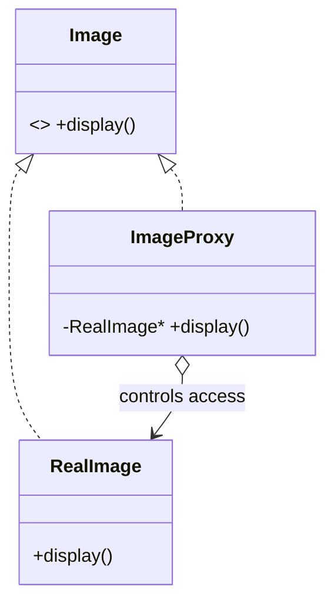

# Chapter 3 — Structural Patterns

> **Theme:** Compose objects and classes into larger, flexible structures while keeping these structures efficient and decoupled. Where creational patterns answer *"how is it made?"*, structural patterns answer *"how do pieces fit together?"*

Patterns in this chapter:
- [3.1 Adapter](#31-adapter-beginner)
- [3.2 Bridge](#32-bridge-intermediate)
- [3.3 Composite](#33-composite-intermediate)
- [3.4 Decorator](#34-decorator-intermediate)
- [3.5 Facade](#35-facade-beginner)
- [3.6 Flyweight](#36-flyweight-advanced)
- [3.7 Proxy](#37-proxy-intermediate)

---

## 3.1 Adapter *(Beginner)*

### 🎯 Definition
Convert the interface of a class into another interface clients expect. Adapter lets classes with **incompatible interfaces** work together.

### ❓ The Problem It Solves
You have existing, working code that expects interface `A`, and a useful class (often third-party or legacy) that offers interface `B`. You can't (or shouldn't) modify either. You need a *translator*.

### Background Problems in Naive Design
Rewriting the client to match the third-party API couples you to that vendor and must be redone if you swap vendors. Editing the third-party library is often impossible.

### 🌍 Real-World Analogy
A **power plug adapter**: your laptop's two-pin plug can't fit a UK three-pin socket. The adapter doesn't change the laptop or the wall — it sits between them and translates the shape.

### 🧩 Conceptual Structure
- **Target** — the interface the client expects.
- **Adaptee** — the existing class with an incompatible interface.
- **Adapter** — implements Target and internally calls Adaptee, translating calls.

Two flavors:
- **Object Adapter** (composition — preferred): the adapter *holds* an adaptee.
- **Class Adapter** (multiple inheritance): the adapter *inherits* from both. Less flexible.



### ⚙️ Step-by-Step Working
1. Identify the interface the client wants (Target).
2. Wrap the Adaptee inside an Adapter that implements Target.
3. Each Target method translates to one or more Adaptee calls (renaming, reordering, converting units/types).
4. The client uses Target and is unaware of the Adaptee.

### ⚖️ Advantages and Tradeoffs
**Pros:** reuse incompatible/legacy code; isolates vendor specifics; honors SRP (translation lives in one place) and OCP (add new adapters without touching client).
**Cons:** extra indirection; too many adapters can clutter; doesn't add new behavior, only translates.

### ✅ When to Use
- Integrating a third-party/legacy class whose interface you can't change.
- Making several different classes present a uniform interface.

### 🚫 When NOT to Use
- You control both sides and can just align the interfaces.
- You actually need to *add behavior* (that's Decorator) or *simplify a subsystem* (that's Facade).

---

### 💻 C++ Implementation (Object Adapter)

```cpp
#include <cmath>
#include <memory>

// Target — what our app expects
struct ModernLogger {
    virtual ~ModernLogger() = default;
    virtual void log(const std::string& level, const std::string& msg) = 0;
};

// Adaptee — a legacy logger we can't modify
struct LegacyLogger {
    void writeLine(int severity, const char* text) { /* ...legacy... */ }
};

// Adapter — implements Target, delegates to Adaptee
class LoggerAdapter : public ModernLogger {
    LegacyLogger legacy_;                       // composition (object adapter)
    static int toSeverity(const std::string& level) {
        return level == "ERROR" ? 3 : level == "WARN" ? 2 : 1;
    }
public:
    void log(const std::string& level, const std::string& msg) override {
        legacy_.writeLine(toSeverity(level), msg.c_str());   // translate
    }
};

// Client code depends only on ModernLogger.
```

### 🧠 C++ Nuances
- **Object adapter (composition) is preferred** over class adapter (multiple/private inheritance) — it's more flexible and avoids the fragility of inheriting from a concrete adaptee.
- **Ownership:** if the adapter owns the adaptee, hold it by value or `unique_ptr`. If the adaptee is shared/externally owned, hold a reference or `shared_ptr`.
- **Type/unit conversions** (string↔enum, metric↔imperial) are classic adapter duties — keep them in one place.
- **Templates:** a *template adapter* can adapt many adaptees without runtime polymorphism (e.g., adapting any container to a uniform interface). STL's `std::stack`/`std::queue` are **container adapters** — Adapter pattern in the standard library.

---

## 3.2 Bridge *(Intermediate)*

### 🎯 Definition
Decouple an **abstraction** from its **implementation** so the two can vary independently.

### ❓ The Problem It Solves
When a class hierarchy varies along *two independent dimensions*, single inheritance forces a combinatorial explosion. E.g., `Shape` × `RenderingAPI`: `Circle`/`Square` × `OpenGL`/`DirectX` → 4 classes; add `Vulkan` and `Triangle` → 9. Bridge splits the two dimensions into separate hierarchies connected by a reference.

### Background Problems in Naive Design
```
Shape
 ├─ CircleOpenGL
 ├─ CircleDirectX
 ├─ SquareOpenGL
 └─ SquareDirectX   // m × n explosion
```

### 🌍 Real-World Analogy
A **TV and its remote**. The *remote* (abstraction) defines operations (on/off, volume). The *TV* (implementation) carries them out. You can pair any remote with any TV brand; either can evolve independently. The remote "bridges" to the TV.

### 🧩 Conceptual Structure
- **Abstraction** — high-level control; holds a reference to an Implementor.
- **RefinedAbstraction** — variants of the abstraction.
- **Implementor** — interface for low-level operations.
- **ConcreteImplementor** — platform/detail-specific implementations.



### ⚙️ Step-by-Step Working
1. Identify the two independent dimensions (e.g., *shape kind* vs *rendering backend*).
2. Put one in the **Abstraction** hierarchy, the other in the **Implementor** hierarchy.
3. The Abstraction holds a pointer to an Implementor and delegates the low-level work to it.
4. Either hierarchy grows independently: m + n classes instead of m × n.

### ⚖️ Advantages and Tradeoffs
**Pros:** eliminates the inheritance explosion; abstraction and implementation evolve separately; can switch implementation at runtime; honors OCP and DIP.
**Cons:** more upfront indirection; only pays off when there really are two varying dimensions.

### ✅ When to Use
- Two (or more) orthogonal dimensions of variation.
- You want to switch implementations at runtime.
- You want to avoid binding abstraction to implementation at compile time.

### 🚫 When NOT to Use
- There's only one dimension of change — plain inheritance or Strategy is simpler.

---

### 💻 C++ Implementation

```cpp
#include <memory>
#include <string>

// Implementor
struct Renderer {
    virtual ~Renderer() = default;
    virtual std::string renderCircle(float r) const = 0;
};
struct VectorRenderer : Renderer {
    std::string renderCircle(float r) const override { return "vector circle r=" + std::to_string(r); }
};
struct RasterRenderer : Renderer {
    std::string renderCircle(float r) const override { return "pixels for circle r=" + std::to_string(r); }
};

// Abstraction — holds a bridge to an Implementor
class Shape {
protected:
    std::shared_ptr<Renderer> renderer_;       // the bridge
public:
    explicit Shape(std::shared_ptr<Renderer> r) : renderer_(std::move(r)) {}
    virtual ~Shape() = default;
    virtual std::string draw() const = 0;
};

// Refined abstraction
class Circle : public Shape {
    float radius_;
public:
    Circle(std::shared_ptr<Renderer> r, float radius)
        : Shape(std::move(r)), radius_(radius) {}
    std::string draw() const override { return renderer_->renderCircle(radius_); }
};

// Usage — mix and match freely:
// auto c1 = Circle(std::make_shared<VectorRenderer>(), 5);
// auto c2 = Circle(std::make_shared<RasterRenderer>(), 5);
```

### 🧠 C++ Nuances
- **`shared_ptr<Renderer>`** is used because the same renderer is often shared by many shapes. If each shape owns its renderer exclusively, use `unique_ptr`.
- **PIMPL (Pointer to IMPLementation)** is a special, very common C++ application of Bridge: a class holds a `unique_ptr<Impl>` to hide implementation details in the `.cpp`, reducing compile-time coupling and stabilizing ABI. (Abstraction = public class, Implementor = hidden `Impl`.)
- **Compile-time firewall:** PIMPL means changing private members doesn't force recompilation of clients.
- **Move semantics:** the renderer is passed by value and `std::move`d into place — efficient transfer of the shared pointer.

---

## 3.3 Composite *(Intermediate)*

### 🎯 Definition
Compose objects into **tree structures** to represent part-whole hierarchies. Composite lets clients treat individual objects and compositions of objects **uniformly**.

### ❓ The Problem It Solves
You have a hierarchy where "containers" hold "items" *and other containers*. You want to run an operation (`render`, `getSize`, `move`) on the whole tree without writing special-case code for leaves vs branches.

### Background Problems in Naive Design
Client code riddled with `if (isFolder) { for each child ... } else { ... }`. Adding a new container type means hunting down every such conditional.

### 🌍 Real-World Analogy
A **filesystem**: a folder contains files and other folders. "Compute total size" works the same whether you point it at a single file or the root folder — the folder just sums its children recursively. A **company org chart** (manager → employees, where a manager is also an employee) is another classic.

### 🧩 Conceptual Structure
- **Component** — common interface for both leaves and composites (`operation()`).
- **Leaf** — a primitive object with no children.
- **Composite** — holds children (Components) and implements `operation()` by delegating to them.
- **Client** — works through the Component interface, oblivious to leaf vs composite.



### ⚙️ Step-by-Step Working
1. Define a Component interface with the operation(s) you want to apply uniformly.
2. Leaves implement the operation directly.
3. Composites store a list of child Components and implement the operation by iterating children and aggregating results (recursion).
4. The client calls `operation()` on the root; recursion handles the whole tree.

### ⚖️ Advantages and Tradeoffs
**Pros:** uniform treatment of parts and wholes; easy to add new component types (OCP); naturally recursive operations.
**Cons:** the uniform interface can become *too general* (a Leaf has to deal with `add()`/`remove()` that don't apply — a design tension between transparency and safety).

### ✅ When to Use
- You have part-whole tree structures (UI widget trees, file systems, scene graphs, ASTs).
- Clients should ignore the difference between individual and composed objects.

### 🚫 When NOT to Use
- The structure isn't really hierarchical/recursive.
- Leaf and composite are so different that a uniform interface is misleading.

---

### 💻 C++ Implementation

```cpp
#include <memory>
#include <vector>
#include <string>

// Component
struct FileSystemNode {
    virtual ~FileSystemNode() = default;
    virtual int size() const = 0;
    virtual std::string name() const = 0;
};

// Leaf
class File : public FileSystemNode {
    std::string name_; int bytes_;
public:
    File(std::string n, int b) : name_(std::move(n)), bytes_(b) {}
    int size() const override { return bytes_; }
    std::string name() const override { return name_; }
};

// Composite
class Directory : public FileSystemNode {
    std::string name_;
    std::vector<std::unique_ptr<FileSystemNode>> children_;
public:
    explicit Directory(std::string n) : name_(std::move(n)) {}
    void add(std::unique_ptr<FileSystemNode> child) {
        children_.push_back(std::move(child));
    }
    int size() const override {                 // recursive aggregation
        int total = 0;
        for (const auto& c : children_) total += c->size();
        return total;
    }
    std::string name() const override { return name_; }
};

// Usage:
// auto root = std::make_unique<Directory>("root");
// root->add(std::make_unique<File>("a.txt", 100));
// auto sub = std::make_unique<Directory>("sub");
// sub->add(std::make_unique<File>("b.txt", 50));
// root->add(std::move(sub));
// root->size();  // 150  — leaves and composites treated uniformly
```

### 🧠 C++ Nuances
- **`vector<unique_ptr<Component>>`** gives the composite *exclusive ownership* of its children. Destroying a directory recursively destroys the whole subtree — no manual cleanup, no leaks (RAII does the recursion for you).
- **Ownership transfer** via `std::move` into `add()` makes the tree's ownership unambiguous.
- **Parent back-pointers**, if needed, must be **non-owning** (`raw pointer` or `weak_ptr`) to avoid ownership cycles.
- **Deep trees** can overflow the stack with naive recursion; for very deep structures, consider an explicit stack/iteration.
- **Transparency vs safety:** putting `add()/remove()` in the base `Component` (transparent) lets clients treat all nodes alike but lets you call `add()` on a `File`. Keeping them only in `Composite` (safe) requires a cast. Choose per your safety needs.

---

## 3.4 Decorator *(Intermediate)*

### 🎯 Definition
Attach additional responsibilities to an object **dynamically**, at runtime. Decorators provide a flexible alternative to subclassing for extending behavior.

### ❓ The Problem It Solves
You want to add features (logging, compression, encryption, scrolling, borders) to objects *in arbitrary combinations* without a subclass explosion, and ideally per-instance and at runtime.

### Background Problems in Naive Design
The combinatorial explosion from §1.6: `EncryptedCompressedStream`, `CompressedEncryptedStream`, `LoggedEncryptedStream`… Inheritance bakes the combination in at compile time and multiplies classes.

### 🌍 Real-World Analogy
**Getting dressed.** Your body is the core object. You add a shirt, then a sweater, then a raincoat — each "wraps" the previous and adds warmth/protection. You can add/remove layers in any order, at runtime, and each layer still presents "you."

### 🧩 Conceptual Structure
- **Component** — interface for objects that can have responsibilities added.
- **ConcreteComponent** — the base object being decorated.
- **Decorator** — implements Component *and* holds a Component; delegates to it and adds behavior before/after.
- **ConcreteDecorator** — adds a specific responsibility.



### ⚙️ Step-by-Step Working
1. Decorator and ConcreteComponent share the same Component interface — so a decorated object is still "a Component."
2. A decorator wraps a Component and forwards calls to it.
3. Before/after forwarding, the decorator adds its own behavior (extra cost, extra processing).
4. Decorators can wrap decorators, building a chain. The client calls the outermost; the call cascades inward.

### ⚖️ Advantages and Tradeoffs
**Pros:** add/remove responsibilities at runtime; combine features freely; each decorator is a small SRP-honoring class; avoids subclass explosion.
**Cons:** many small objects; debugging a deep wrap chain is harder; order can matter (encrypt-then-compress ≠ compress-then-encrypt); the wrapped object's identity differs from the wrapper (can't easily `==` compare).

### ✅ When to Use
- You need to add responsibilities to individual objects dynamically and transparently.
- Extension by subclassing would explode combinatorially.

### 🚫 When NOT to Use
- The feature set is fixed and small — a constructor flag or subclass is simpler.
- You actually need to *control access* (Proxy) rather than *add behavior*.

---

### 💻 C++ Implementation

```cpp
#include <memory>
#include <string>

// Component
struct Coffee {
    virtual ~Coffee() = default;
    virtual double cost() const = 0;
    virtual std::string desc() const = 0;
};

// ConcreteComponent
struct SimpleCoffee : Coffee {
    double cost() const override { return 2.0; }
    std::string desc() const override { return "coffee"; }
};

// Base Decorator — holds a wrapped Coffee
class CoffeeDecorator : public Coffee {
protected:
    std::unique_ptr<Coffee> inner_;
public:
    explicit CoffeeDecorator(std::unique_ptr<Coffee> c) : inner_(std::move(c)) {}
};

// Concrete decorators
class WithMilk : public CoffeeDecorator {
public:
    using CoffeeDecorator::CoffeeDecorator;
    double cost() const override { return inner_->cost() + 0.5; }
    std::string desc() const override { return inner_->desc() + " + milk"; }
};
class WithSugar : public CoffeeDecorator {
public:
    using CoffeeDecorator::CoffeeDecorator;
    double cost() const override { return inner_->cost() + 0.25; }
    std::string desc() const override { return inner_->desc() + " + sugar"; }
};

// Usage — wrap freely:
// std::unique_ptr<Coffee> order =
//     std::make_unique<WithSugar>(
//         std::make_unique<WithMilk>(
//             std::make_unique<SimpleCoffee>()));
// order->desc();  // "coffee + milk + sugar"
// order->cost();  // 2.75
```

### 🧠 C++ Nuances
- **`unique_ptr<Component>` as the wrapped member** gives clean ownership: the outer decorator owns the inner one; destroying the chain frees everything via RAII, innermost last.
- **Ownership transfer:** each layer is `std::move`d into the next — there's a single owning chain, no shared ownership needed.
- **`using CoffeeDecorator::CoffeeDecorator;`** inherits the base constructor — less boilerplate.
- **Order matters** and is encoded by nesting order; document it when behavior is non-commutative (compression/encryption).
- **The standard library uses this idea**: C++ I/O streams and many "wrapper" stream filters are decorator-like.
- **Performance:** each layer adds one virtual call; deep chains add up but are rarely a bottleneck.
- **vs Proxy:** identical structure (wrap + same interface). The *intent* differs — Decorator **adds behavior**, Proxy **controls access**. See [5.4](05-Pattern-Comparisons.md#54-decorator-vs-proxy).

---

## 3.5 Facade *(Beginner)*

### 🎯 Definition
Provide a **unified, simplified interface** to a set of interfaces in a subsystem. Facade defines a higher-level interface that makes the subsystem easier to use.

### ❓ The Problem It Solves
A subsystem has many classes with intricate interdependencies and initialization order. Clients shouldn't need a PhD in the subsystem to do common tasks. A facade offers a few simple methods that orchestrate the complexity behind the scenes.

### Background Problems in Naive Design
Every client repeats the same 12-step dance of wiring subsystem objects together, duplicating knowledge and breaking whenever the subsystem changes.

### 🌍 Real-World Analogy
A **restaurant waiter**. You say "I'll have the steak." You don't talk to the chef, the inventory system, the grill, and the dishwasher. The waiter (facade) coordinates all of that and gives you a simple interface: order in, food out.

### 🧩 Conceptual Structure
- **Facade** — knows the subsystem classes and delegates client requests to them.
- **Subsystem classes** — do the real work; unaware of the facade.
- **Client** — talks to the Facade instead of the subsystem.



### ⚙️ Step-by-Step Working
1. Identify common client tasks that currently require many subsystem calls.
2. Create a Facade exposing those tasks as simple methods.
3. Each facade method performs the orchestration (correct order, wiring, error handling).
4. Clients use the facade; advanced clients may still reach into the subsystem directly when needed.

### ⚖️ Advantages and Tradeoffs
**Pros:** simplifies usage; decouples clients from subsystem internals; provides a stable entry point; reduces compile dependencies.
**Cons:** can become a **god object** if it accumulates too much; doesn't prevent access to the subsystem (by design) so it's a convenience, not an enforcement.

### ✅ When to Use
- You want a simple entry point to a complex subsystem.
- You want to layer your system and decouple layers.

### 🚫 When NOT to Use
- The subsystem is already simple.
- You need to *adapt* one interface to another (Adapter) or *control access* (Proxy) — those have different intents.

---

### 💻 C++ Implementation

```cpp
// Complex subsystem
struct VideoFile        { /* parse container */ };
struct AudioMixer       { void mix() {} };
struct BitrateReader    { void read() {} };
struct CodecFactory     { void pick() {} };

// Facade
class VideoConverter {
public:
    std::string convert(const std::string& file, const std::string& fmt) {
        VideoFile vf;
        CodecFactory cf;   cf.pick();
        BitrateReader br;  br.read();
        AudioMixer am;     am.mix();
        // ...orchestrate the messy steps in the right order...
        return file + " -> " + fmt;
    }
};

// Client:
// VideoConverter c;
// c.convert("clip.mov", "mp4");   // one call hides all the complexity
```

### 🧠 C++ Nuances
- **Header hygiene:** a facade can hide heavy subsystem headers behind its own header (often combined with **PIMPL**) so clients don't transitively include the whole subsystem — faster builds, smaller ABI surface.
- **Lifetime:** the facade typically *owns or holds* subsystem objects; use members by value, `unique_ptr`, or construct them per-call as above.
- **Keep it thin:** a facade should *delegate*, not implement business logic — otherwise it drifts toward a god object.

---

## 3.6 Flyweight *(Advanced)*

### 🎯 Definition
Use **sharing** to support large numbers of fine-grained objects efficiently by separating **intrinsic** (shared) state from **extrinsic** (context-specific) state.

### ❓ The Problem It Solves
You need millions of objects (characters in a document, tiles in a map, particles, tree sprites in a forest) and the memory cost is prohibitive because each duplicates the same heavy data (glyph shape, texture).

### Background Problems in Naive Design
`new Character('a', font, bitmap)` a million times duplicates the *same* glyph bitmap a million times. RAM explodes.

### 🌍 Real-World Analogy
A **forest game** with 1,000,000 trees. Each tree's *mesh, texture, color* (intrinsic) is identical across thousands of trees, so store one shared "TreeType." Each tree's *x/y position* (extrinsic) is unique and stays with the individual tree. One shared model, a million cheap positions.

### 🧩 Conceptual Structure
- **Flyweight** — stores intrinsic (shareable) state; operations take extrinsic state as parameters.
- **FlyweightFactory** — creates and *pools* flyweights, returning a shared instance for a given intrinsic key.
- **Context / Client** — stores extrinsic state and passes it into flyweight operations.



### ⚙️ Step-by-Step Working
1. Split object state into **intrinsic** (independent of context, shareable) and **extrinsic** (depends on context, not shareable).
2. Move intrinsic state into a Flyweight object.
3. A factory returns shared Flyweight instances (creating once, caching forever).
4. Clients store extrinsic state and pass it as arguments to flyweight methods.

### ⚖️ Advantages and Tradeoffs
**Pros:** massive memory savings; can improve cache locality.
**Cons:** complexity; you trade RAM for CPU (extrinsic state must be passed/recomputed); flyweights must be **immutable** to be safely shared; harder to reason about.

### ✅ When to Use
- A huge number of objects with lots of duplicated, shareable state.
- Memory is the bottleneck and most state can be made extrinsic.

### 🚫 When NOT to Use
- Few objects, or little shareable state.
- The objects must be mutable per-instance.

---

### 💻 C++ Implementation

```cpp
#include <memory>
#include <unordered_map>
#include <string>

// Flyweight — stores INTRINSIC, immutable, shared state
class Glyph {
    char symbol_;
    std::string fontData_;                 // heavy, shared
public:
    Glyph(char s, std::string font) : symbol_(s), fontData_(std::move(font)) {}
    // extrinsic state (position) passed in per call:
    std::string draw(int x, int y) const {
        return std::string(1, symbol_) + "@(" + std::to_string(x) + "," + std::to_string(y) + ")";
    }
};

// Factory pools and shares flyweights
class GlyphFactory {
    std::unordered_map<char, std::shared_ptr<const Glyph>> pool_;
public:
    std::shared_ptr<const Glyph> get(char c) {
        auto it = pool_.find(c);
        if (it != pool_.end()) return it->second;
        auto g = std::make_shared<const Glyph>(c, /*load heavy font*/ "FontBlob");
        pool_[c] = g;
        return g;
    }
};

// Client stores extrinsic state + a shared flyweight handle
struct PlacedGlyph {
    std::shared_ptr<const Glyph> glyph;    // shared
    int x, y;                              // extrinsic, unique
};
```

### 🧠 C++ Nuances
- **`shared_ptr<const Glyph>`**: shared ownership (the pool and all users share it) and `const` enforces **immutability** — essential for safe sharing across threads/contexts.
- **The pool/cache** keeps one instance per intrinsic key; this is the heart of the memory saving.
- **Extrinsic state** (`x`, `y`) is tiny and lives in the lightweight `PlacedGlyph`.
- **Thread safety:** immutable flyweights are safe to share across threads; the *factory's* map needs synchronization if accessed concurrently.
- **Alternative ownership:** if flyweights live forever, you can store them in a container and hand out `const Glyph*` (non-owning) instead of `shared_ptr`, avoiding refcount overhead.
- **Interning** (e.g., string interning) is Flyweight applied to strings.

---

## 3.7 Proxy *(Intermediate)*

### 🎯 Definition
Provide a **surrogate or placeholder** for another object to **control access** to it.

### ❓ The Problem It Solves
You want to interpose logic *between* the client and the real object: lazy creation, access control, caching, logging, remote communication, reference counting — *without* changing the real object or the client.

### Background Problems in Naive Design
Embedding lazy-loading or permission checks inside the real object violates SRP and clutters it. Doing it in every client duplicates logic. A proxy centralizes it transparently.

### 🌍 Real-World Analogy
A **credit card** is a proxy for your bank account. It presents the same "pay" interface as cash but adds access control (PIN), logging (statements), and limits — without you carrying the actual cash. A **security guard** at a door is an access-control proxy.

### 🧩 Conceptual Structure
- **Subject** — common interface for RealSubject and Proxy.
- **RealSubject** — the real object doing the work.
- **Proxy** — implements Subject, holds a reference to RealSubject, controls access and forwards requests.

Common proxy kinds:
- **Virtual proxy** — lazy/expensive object creation.
- **Protection proxy** — access control.
- **Remote proxy** — stands in for an object in another address space.
- **Caching proxy** — memoizes results.
- **Smart reference** — refcounting/logging (e.g., `shared_ptr` itself is a smart-pointer proxy).



### ⚙️ Step-by-Step Working
1. Proxy implements the same interface as the real subject (so clients can't tell the difference).
2. The client calls the proxy.
3. The proxy decides: create the real object now? check permission? return a cached result? log?
4. When appropriate, it forwards to the real subject and returns the result.

### ⚖️ Advantages and Tradeoffs
**Pros:** controls access transparently; enables lazy loading, caching, security, remoting; honors OCP (add a proxy without touching the subject).
**Cons:** extra indirection/latency; another class to maintain; the response may be delayed (lazy creation).

### ✅ When to Use
- Lazy initialization of a heavy object (virtual proxy).
- Access control (protection proxy).
- Caching, logging, or remote access.

### 🚫 When NOT to Use
- You want to *add features* to the interface (Decorator) rather than *control access*.
- No cross-cutting concern justifies the indirection.

---

### 💻 C++ Implementation (Virtual / lazy-loading proxy)

```cpp
#include <memory>
#include <string>
#include <iostream>

struct Image {
    virtual ~Image() = default;
    virtual void display() = 0;
};

// RealSubject — expensive to construct (loads from disk)
class RealImage : public Image {
    std::string file_;
public:
    explicit RealImage(std::string f) : file_(std::move(f)) {
        /* expensive: load pixels from disk now */
    }
    void display() override { /* draw pixels */ }
};

// Virtual Proxy — defers the expensive load until first use
class ImageProxy : public Image {
    std::string file_;
    std::unique_ptr<RealImage> real_;          // created on demand
public:
    explicit ImageProxy(std::string f) : file_(std::move(f)) {}
    void display() override {
        if (!real_) real_ = std::make_unique<RealImage>(file_); // lazy init
        real_->display();
    }
};

// Client: cheap to create many proxies; pixels load only when shown.
// std::unique_ptr<Image> img = std::make_unique<ImageProxy>("huge.png");
// ... // no disk I/O yet
// img->display(); // NOW it loads
```

### 🧠 C++ Nuances
- **`unique_ptr<RealImage>`** holds the lazily-created subject; it's `nullptr` until first use — the classic *virtual proxy* mechanism.
- **C++ smart pointers are themselves proxies**: `shared_ptr` adds reference counting; `weak_ptr` adds safe non-owning access; a custom smart pointer can add logging/locking. This is the *smart reference* proxy in the language itself.
- **Protection proxy:** check credentials in the proxy method before forwarding.
- **Thread safety:** lazy init needs synchronization (`std::call_once` / mutex) if the proxy is shared across threads.
- **vs Decorator:** same wrapping structure; Proxy controls *access/lifetime*, Decorator adds *behavior*. See [5.4](05-Pattern-Comparisons.md#54-decorator-vs-proxy).

---

### Structural Patterns — Quick Recap

| Pattern | One-liner | Key force |
|---|---|---|
| Adapter | Translate one interface to another | Compatibility with existing code |
| Bridge | Split abstraction from implementation | Two independent dimensions |
| Composite | Treat trees uniformly | Part-whole hierarchies |
| Decorator | Add behavior by wrapping | Dynamic, combinable features |
| Facade | Simple front to complex subsystem | Reduce client complexity |
| Flyweight | Share intrinsic state | Memory for many objects |
| Proxy | Control access to an object | Lazy/secure/cached access |

> Compare Adapter vs Facade in [5.3](05-Pattern-Comparisons.md#53-adapter-vs-facade) and Decorator vs Proxy in [5.4](05-Pattern-Comparisons.md#54-decorator-vs-proxy).

*Next: [Chapter 4 — Behavioral Patterns →](04-Behavioral-Patterns.md)*
