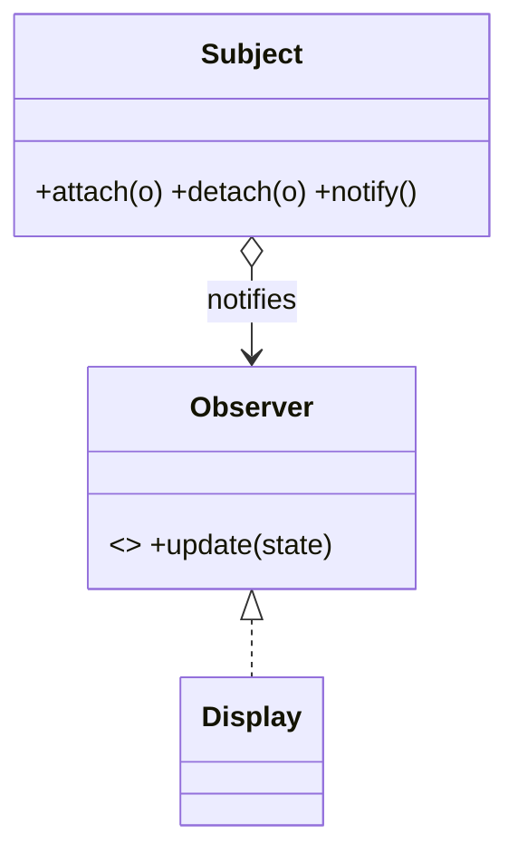
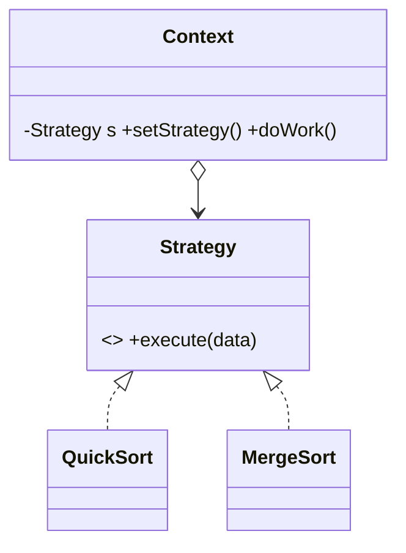
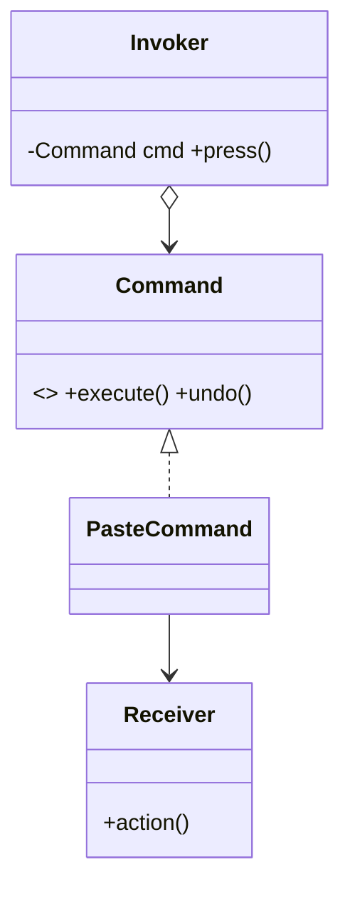
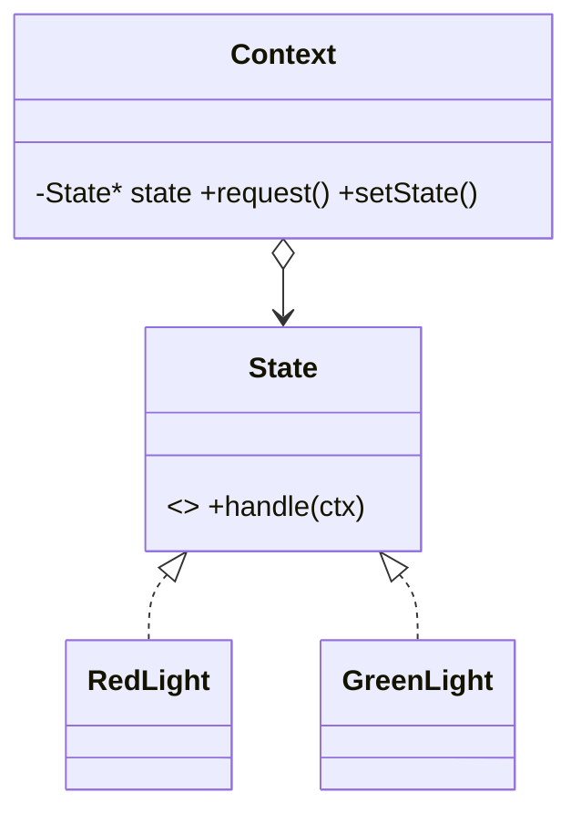
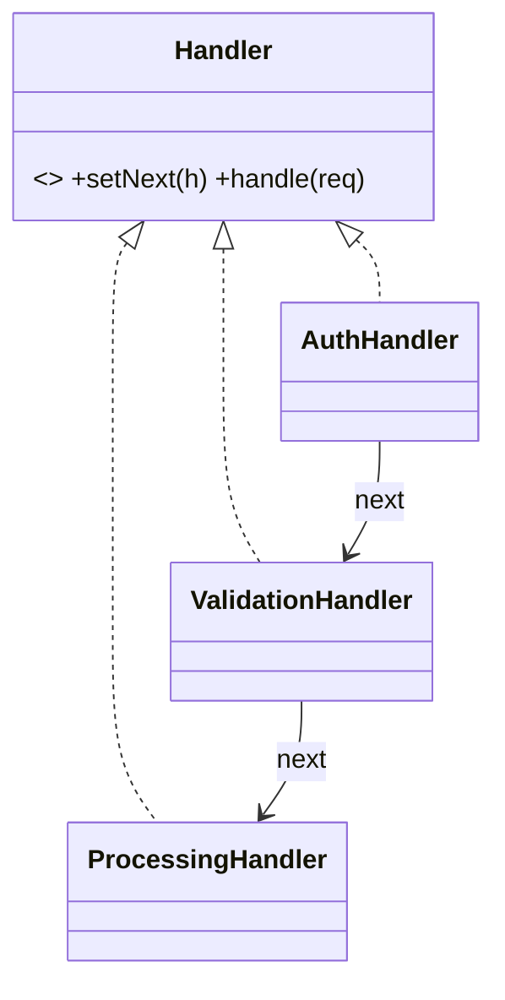
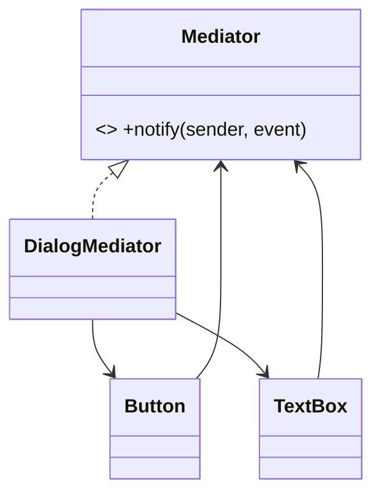
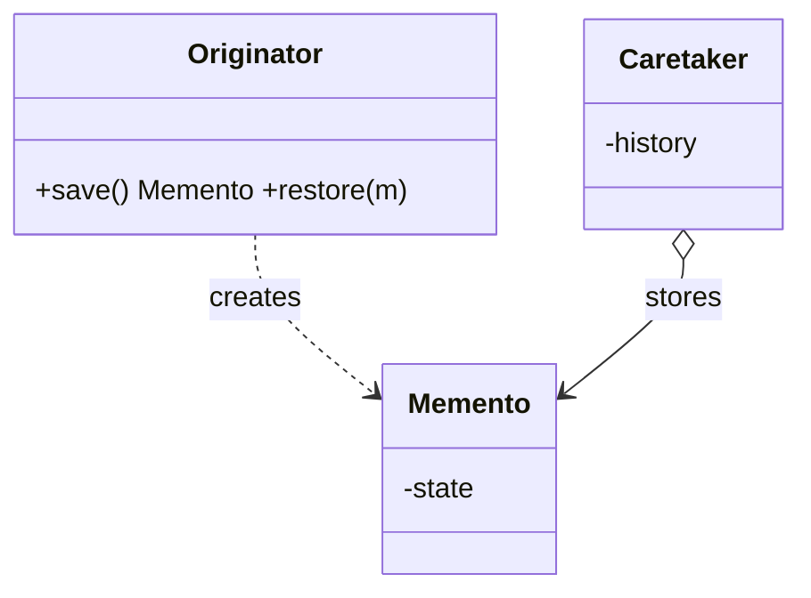
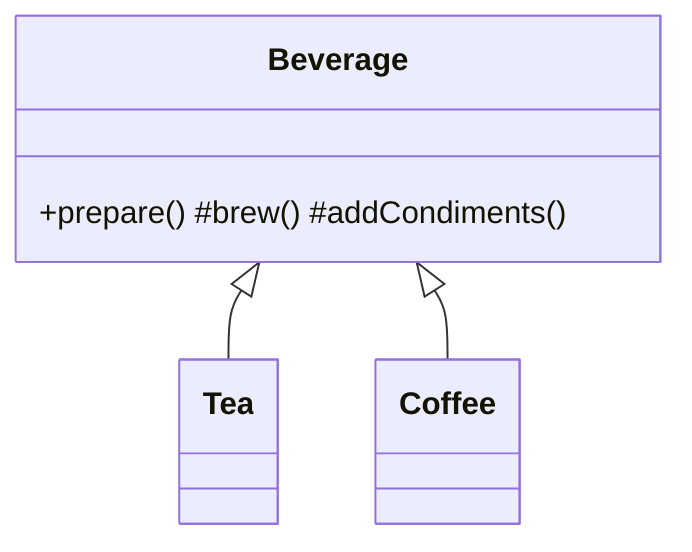
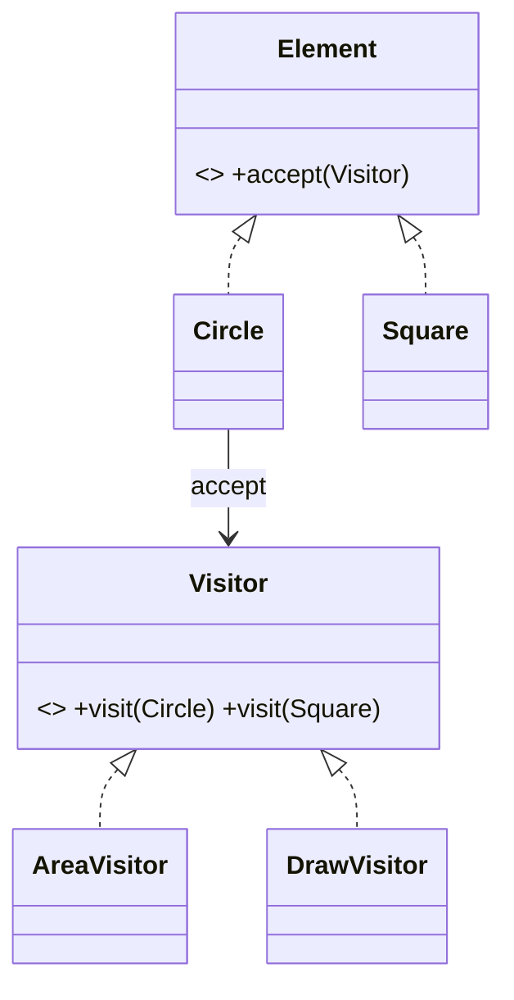
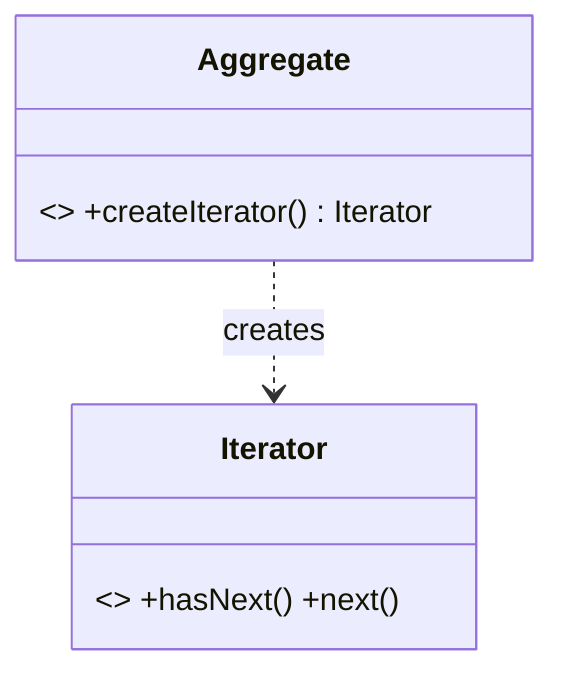

# Chapter 4 — Behavioral Patterns

> **Theme:** Define how objects *communicate*, how *responsibility is distributed*, and how *algorithms* are encapsulated and made interchangeable. These patterns are about *interaction and behavior*, not creation or structure.

Patterns in this chapter:
- [4.1 Observer](#41-observer-intermediate)
- [4.2 Strategy](#42-strategy-beginner)
- [4.3 Command](#43-command-intermediate)
- [4.4 State](#44-state-intermediate)
- [4.5 Chain of Responsibility](#45-chain-of-responsibility-intermediate)
- [4.6 Mediator](#46-mediator-intermediate)
- [4.7 Memento](#47-memento-intermediate)
- [4.8 Template Method](#48-template-method-beginner)
- [4.9 Visitor](#49-visitor-advanced)
- [4.10 Iterator](#410-iterator-beginner--intermediate)

---

## 4.1 Observer *(Intermediate)*

### 🎯 Definition
Define a **one-to-many dependency** so that when one object (the **Subject**) changes state, all its dependents (**Observers**) are notified and updated automatically.

### ❓ The Problem It Solves
Many objects need to react to changes in another object, but the source shouldn't be hardcoded to know its consumers. You want **publish/subscribe**: the subject broadcasts; interested parties subscribe and react.

### Background Problems in Naive Design
If a `WeatherStation` directly calls `phoneDisplay.update()`, `webDisplay.update()`, … it's tightly coupled to every display and must be edited whenever a display is added. **Polling** ("ask every second if it changed") wastes CPU and is laggy.

### 🌍 Real-World Analogy
A **newspaper/magazine subscription**. The publisher doesn't know its readers personally; readers *subscribe*. When a new issue is out, every current subscriber gets a copy. Subscribe/unsubscribe anytime.

### 🧩 Conceptual Structure
- **Subject (Observable)** — maintains a list of observers; provides attach/detach; notifies them.
- **Observer** — interface with an `update()` callback.
- **ConcreteObserver** — reacts to notifications, possibly querying the subject for details.



### ⚙️ Step-by-Step Working
1. Observers subscribe to the subject (attach).
2. The subject's state changes.
3. The subject iterates its observer list and calls `update()` on each (push the data, or let observers pull it).
4. Observers react. They can unsubscribe (detach) anytime.

### ⚖️ Advantages and Tradeoffs
**Pros:** loose coupling (subject knows only the Observer interface); dynamic subscription; supports broadcast; OCP (add observers freely).
**Cons:** notification order is unspecified; risk of *update storms*/cascades; **dangling observers** (lapsed-listener leak) if you forget to detach; debugging indirect flows is harder.

### ✅ When to Use
- A change to one object requires changing others, and you don't know how many.
- Event systems, UI data binding, model-view architectures, reactive streams.

### 🚫 When NOT to Use
- Simple, direct, one-to-one calls suffice.
- Notification cascades would be hard to reason about or could loop.

---

### 💻 C++ Implementation

```cpp
#include <memory>
#include <vector>
#include <algorithm>
#include <string>

// Observer interface
struct Observer {
    virtual ~Observer() = default;
    virtual void update(int temperature) = 0;
};

// Subject
class WeatherStation {
    std::vector<std::weak_ptr<Observer>> observers_;   // non-owning!
    int temp_{0};
public:
    void attach(std::shared_ptr<Observer> o) { observers_.push_back(o); }

    void setTemperature(int t) {
        temp_ = t;
        notify();
    }
private:
    void notify() {
        // prune dead observers and notify live ones
        for (auto it = observers_.begin(); it != observers_.end();) {
            if (auto o = it->lock()) { o->update(temp_); ++it; }
            else it = observers_.erase(it);                // expired observer
        }
    }
};

// Concrete observer
struct PhoneDisplay : Observer {
    void update(int t) override { /* show t */ }
};

// Usage:
// auto station = WeatherStation{};
// auto phone = std::make_shared<PhoneDisplay>();
// station.attach(phone);
// station.setTemperature(25);   // phone->update(25) fires
```

### 🧠 C++ Nuances
- **`weak_ptr<Observer>`** is the key idiom: the subject must **not own** its observers (they have their own lifetime). `weak_ptr` lets the subject notify *if still alive* and detect/prune expired ones — this prevents the **lapsed-listener leak** and dangling-pointer crashes.
- `lock()` returns a temporary `shared_ptr`; if null, the observer is gone.
- **Avoid reference cycles:** if observer also holds a `shared_ptr` to the subject, you'd leak — keep one direction `weak`.
- **Thread safety:** concurrent attach/notify needs a mutex; copy the observer list under lock, then notify outside the lock to avoid re-entrancy deadlocks.
- **Modern alternative:** `std::function` callbacks (signals/slots) instead of an `Observer` interface — more flexible, no subclassing; libraries like Boost.Signals2 / Qt signals do this.

---

## 4.2 Strategy *(Beginner)*

### 🎯 Definition
Define a family of algorithms, encapsulate each one, and make them **interchangeable**. Strategy lets the algorithm vary independently from the clients that use it.

### ❓ The Problem It Solves
A class needs to perform a task that has multiple algorithms (sorting orders, compression methods, routing strategies, payment methods), and you want to choose/swap the algorithm at runtime without bloating the class with conditionals.

### Background Problems in Naive Design
```cpp
void route(Mode m) {
    if (m == CAR) { /*...*/ }
    else if (m == BIKE) { /*...*/ }
    else if (m == WALK) { /*...*/ }   // grows forever; violates OCP
}
```
Every new mode edits this method. The class accumulates unrelated algorithms (low cohesion).

### 🌍 Real-World Analogy
A **navigation app**. "Get me there" is the task; "by car / by bike / on foot / public transit" are interchangeable strategies. You pick one; the app's overall flow is unchanged.

### 🧩 Conceptual Structure
- **Strategy** — common interface for all algorithms.
- **ConcreteStrategy** — one algorithm each.
- **Context** — holds a Strategy and delegates the work to it; can swap strategies.



### ⚙️ Step-by-Step Working
1. Define a Strategy interface for the varying algorithm.
2. Implement each algorithm as a ConcreteStrategy.
3. The Context holds a reference to a Strategy and calls it instead of using conditionals.
4. Client injects/swaps the strategy at runtime.

### ⚖️ Advantages and Tradeoffs
**Pros:** swap algorithms at runtime; eliminates conditionals; each algorithm isolated and testable (SRP); OCP (add strategies without touching the context).
**Cons:** clients must know the strategies to choose; more objects/classes; overkill if there's only ever one algorithm.

### ✅ When to Use
- Multiple variants of an algorithm.
- You want to choose behavior at runtime.
- You want to replace big conditional blocks with polymorphism.

### 🚫 When NOT to Use
- There's a single algorithm that won't vary.
- The "strategies" differ only by a constant — a parameter is enough.

---

### 💻 C++ Implementation

#### ✅ Classic (interface) Strategy
```cpp
#include <memory>
#include <vector>

struct SortStrategy {
    virtual ~SortStrategy() = default;
    virtual void sort(std::vector<int>&) const = 0;
};
struct QuickSort : SortStrategy { void sort(std::vector<int>& v) const override { /*...*/ } };
struct BubbleSort : SortStrategy { void sort(std::vector<int>& v) const override { /*...*/ } };

class Sorter {
    std::unique_ptr<SortStrategy> strategy_;
public:
    explicit Sorter(std::unique_ptr<SortStrategy> s) : strategy_(std::move(s)) {}
    void setStrategy(std::unique_ptr<SortStrategy> s) { strategy_ = std::move(s); }
    void sort(std::vector<int>& v) const { strategy_->sort(v); }
};
```

#### ✅ Modern C++ Strategy with `std::function` (no class hierarchy)
```cpp
#include <functional>
#include <vector>

class Sorter {
    std::function<void(std::vector<int>&)> strategy_;
public:
    explicit Sorter(std::function<void(std::vector<int>&)> s) : strategy_(std::move(s)) {}
    void sort(std::vector<int>& v) const { strategy_(v); }
};

// Usage: lambdas ARE strategies
// Sorter s([](std::vector<int>& v){ std::sort(v.begin(), v.end()); });
```

### 🧠 C++ Nuances
- **`std::function` + lambdas** is the idiomatic modern alternative to a class hierarchy when strategies are simple and stateless — less boilerplate, captures allow parameterization. Cost: small allocation/indirection inside `std::function`.
- **Templates (policy-based design)** give *compile-time* strategy with **zero runtime overhead** — pass the strategy as a template parameter. Use when the strategy is known at compile time and performance is critical (e.g., allocators, comparators). `std::sort`'s comparator is a compile-time strategy.
- **`unique_ptr<Strategy>`** for runtime-swappable, stateful strategies; ownership is exclusive and clear.
- **Strategy vs State:** Strategy is chosen by the client and usually doesn't change itself; State transitions are driven internally. See [5.2](05-Pattern-Comparisons.md#52-strategy-vs-state).

---

## 4.3 Command *(Intermediate)*

### 🎯 Definition
Encapsulate a **request as an object**, thereby letting you parameterize clients with different requests, queue or log requests, and support **undoable** operations.

### ❓ The Problem It Solves
You want to decouple the object that *invokes* an operation from the object that *knows how to perform* it — and treat operations as first-class things you can store, queue, schedule, log, or undo.

### Background Problems in Naive Design
A button hardwired to `document.save()` can't be reused for other actions, can't be queued, logged, or undone. Menu items, buttons, and shortcuts each duplicate the call.

### 🌍 Real-World Analogy
A **restaurant order ticket**. The waiter writes your request on a ticket (command object). The ticket can be queued, passed to the kitchen, logged, and — if you change your mind in time — cancelled. The waiter doesn't cook; the chef does. The ticket decouples them.

### 🧩 Conceptual Structure
- **Command** — interface with `execute()` (and often `undo()`).
- **ConcreteCommand** — binds a Receiver to an action; stores parameters.
- **Receiver** — knows how to perform the work.
- **Invoker** — triggers commands (button, scheduler); holds/queues them.
- **Client** — creates and configures commands.



### ⚙️ Step-by-Step Working
1. Wrap each operation (and its target + arguments) in a Command object.
2. The Invoker holds Commands and calls `execute()` when triggered — without knowing what they do.
3. For undo, each command records enough state to reverse itself via `undo()`.
4. Commands can be stored in a history stack, a queue, or a log.

### ⚖️ Advantages and Tradeoffs
**Pros:** decouples invoker from receiver; enables undo/redo, queuing, logging, macros (composite commands), and deferred/remote execution; OCP (new commands without changing the invoker).
**Cons:** many small command classes; undo requires careful state capture; can be overkill for trivial actions.

### ✅ When to Use
- Undo/redo, transaction logs, task queues, macro recording.
- Decoupling UI controls from business actions.

### 🚫 When NOT to Use
- A simple direct call suffices and you'll never queue/undo/log it.

---

### 💻 C++ Implementation (with undo)

```cpp
#include <memory>
#include <vector>
#include <string>

// Receiver
class TextDocument {
    std::string text_;
public:
    void append(const std::string& s) { text_ += s; }
    void removeLast(std::size_t n)     { text_.erase(text_.size() - n); }
    const std::string& text() const    { return text_; }
};

// Command
struct Command {
    virtual ~Command() = default;
    virtual void execute() = 0;
    virtual void undo()    = 0;
};

// Concrete command
class AppendCommand : public Command {
    TextDocument& doc_;
    std::string text_;
public:
    AppendCommand(TextDocument& d, std::string t) : doc_(d), text_(std::move(t)) {}
    void execute() override { doc_.append(text_); }
    void undo()    override { doc_.removeLast(text_.size()); }
};

// Invoker with history
class Editor {
    std::vector<std::unique_ptr<Command>> history_;
public:
    void run(std::unique_ptr<Command> c) {
        c->execute();
        history_.push_back(std::move(c));
    }
    void undoLast() {
        if (history_.empty()) return;
        history_.back()->undo();
        history_.pop_back();
    }
};
```

### 🧠 C++ Nuances
- **`unique_ptr<Command>` in a history vector** gives an owning undo stack; popping destroys the command (RAII).
- **Receiver held by reference** (`TextDocument&`) — the command doesn't own the document; ensure the document outlives the commands (or use `shared_ptr` if lifetimes are entangled).
- **`std::function` commands:** for simple, stateless actions a `std::vector<std::function<void()>>` queue is a lightweight command pattern (loses easy `undo` unless you pair execute/undo lambdas).
- **Macro commands** = Composite + Command: a command holding a vector of sub-commands.
- **Memento synergy:** for complex undo, a command can store a Memento of prior state instead of computing the inverse. See [4.7](#47-memento-intermediate).

---

## 4.4 State *(Intermediate)*

### 🎯 Definition
Allow an object to **alter its behavior when its internal state changes**. The object appears to change its class.

### ❓ The Problem It Solves
An object behaves very differently depending on its current state, and the state-dependent logic is scattered across many methods as large conditionals. You want each state's behavior in one place and transitions to be explicit.

### Background Problems in Naive Design
```cpp
void Document::publish() {
    if (state == DRAFT)         { state = MODERATION; }
    else if (state == MODERATION) { state = (user.isAdmin() ? PUBLISHED : MODERATION); }
    else if (state == PUBLISHED) { /* nothing */ }
}
// ...and the SAME switch repeated in render(), edit(), delete()...
```
Every method repeats the state switch; adding a state edits all of them.

### 🌍 Real-World Analogy
A **traffic light** (or a vending machine). In *Red* state it behaves one way and transitions to *Green*; in *Green* it behaves differently and transitions to *Yellow*. Each state knows its own behavior and its successor.

### 🧩 Conceptual Structure
- **Context** — holds a reference to a State object; delegates state-specific behavior to it.
- **State** — interface for behavior associated with a state.
- **ConcreteState** — implements behavior for one state and triggers transitions (often by setting the context's state).



### ⚙️ Step-by-Step Working
1. Extract each state's behavior into a ConcreteState class.
2. The Context delegates state-dependent calls to the current State object.
3. A State, when handling a request, may transition the Context to another State.
4. Adding a state = add a class; no giant switches to edit.

### ⚖️ Advantages and Tradeoffs
**Pros:** removes massive conditionals; each state isolated (SRP); transitions explicit; OCP (add states freely).
**Cons:** more classes; transition logic can be spread across states (can be centralized in the context or a table); overkill for two trivial states.

### ✅ When to Use
- Object behavior depends heavily on state, with complex state-specific logic.
- A state machine (workflow, protocol, game character, parser).

### 🚫 When NOT to Use
- Very few states with trivial differences — a simple enum + switch is fine.

---

### 💻 C++ Implementation

```cpp
#include <memory>
#include <string>

class TrafficLight;                       // forward

struct LightState {
    virtual ~LightState() = default;
    virtual void next(TrafficLight& ctx) = 0;
    virtual std::string name() const = 0;
};

class TrafficLight {
    std::unique_ptr<LightState> state_;
public:
    explicit TrafficLight(std::unique_ptr<LightState> s) : state_(std::move(s)) {}
    void setState(std::unique_ptr<LightState> s) { state_ = std::move(s); }
    void change() { state_->next(*this); }
    std::string current() const { return state_->name(); }
};

struct Green;  struct Yellow;  struct Red;

struct Red : LightState {
    void next(TrafficLight& ctx) override;          // -> Green
    std::string name() const override { return "RED"; }
};
struct Green : LightState {
    void next(TrafficLight& ctx) override;          // -> Yellow
    std::string name() const override { return "GREEN"; }
};
struct Yellow : LightState {
    void next(TrafficLight& ctx) override;          // -> Red
    std::string name() const override { return "YELLOW"; }
};

void Red::next(TrafficLight& ctx)    { ctx.setState(std::make_unique<Green>()); }
void Green::next(TrafficLight& ctx)  { ctx.setState(std::make_unique<Yellow>()); }
void Yellow::next(TrafficLight& ctx) { ctx.setState(std::make_unique<Red>()); }
```

### 🧠 C++ Nuances
- **`unique_ptr<State>` in the context** owns the current state; transitions `std::move` a new state in, freeing the old one automatically.
- **Forward declarations** are needed because states reference each other cyclically — a common C++ wrinkle. Define `next()` out-of-line after all states are declared.
- **Stateless states** can be **shared singletons** (return `State&` from a registry) to avoid per-transition allocation — better for hot paths.
- **vs Strategy:** identical structure; the difference is *intent* — State objects know about and trigger transitions among themselves; Strategy objects are independent and chosen externally. See [5.2](05-Pattern-Comparisons.md#52-strategy-vs-state).

---

## 4.5 Chain of Responsibility *(Intermediate)*

### 🎯 Definition
Pass a request along a **chain of handlers**. Each handler decides either to process the request or to pass it to the next handler.

### ❓ The Problem It Solves
A request might be handled by one of several handlers, and you don't want the sender coupled to a specific receiver. You want to add/reorder/remove handlers freely and let each decide whether it's responsible.

### Background Problems in Naive Design
A monolithic method with nested `if/else` deciding who handles what (auth → validation → logging → processing) is rigid and hard to reorder or extend.

### 🌍 Real-World Analogy
**Technical support escalation**: your call goes to L1 support; if they can't help, it escalates to L2, then to engineering. Each level either resolves it or passes it up. The caller doesn't know who will ultimately handle it.

### 🧩 Conceptual Structure
- **Handler** — interface with `handle(request)` and a link to the next handler.
- **ConcreteHandler** — handles requests it can; otherwise forwards.
- **Client** — builds the chain and sends requests to the head.



### ⚙️ Step-by-Step Working
1. Each handler holds a pointer to the next handler.
2. A handler receives the request; if it can process it, it does (and may stop or continue).
3. Otherwise it forwards to the next handler.
4. The chain ends when a handler consumes the request or the chain is exhausted.

### ⚖️ Advantages and Tradeoffs
**Pros:** decouples sender from receiver; flexible ordering/composition; each handler is small (SRP); OCP (insert handlers without touching others).
**Cons:** no guarantee a request is handled (may fall off the end); harder to debug flow; potential latency in long chains.

### ✅ When to Use
- Multiple objects may handle a request and the handler isn't known a priori.
- Middleware pipelines (HTTP filters), event bubbling, approval workflows, logging levels.

### 🚫 When NOT to Use
- Exactly one known handler — call it directly.
- You need a guaranteed handler and can't tolerate "unhandled."

---

### 💻 C++ Implementation

```cpp
#include <memory>
#include <string>

struct Request { std::string type; int amount; };

class Handler {
protected:
    std::unique_ptr<Handler> next_;
public:
    virtual ~Handler() = default;
    Handler* setNext(std::unique_ptr<Handler> n) {   // returns raw ptr to chain fluently
        Handler* raw = n.get();
        next_ = std::move(n);
        return raw;
    }
    virtual std::string handle(const Request& r) {
        return next_ ? next_->handle(r) : "unhandled";
    }
};

class AuthHandler : public Handler {
public:
    std::string handle(const Request& r) override {
        if (r.type == "unauthorized") return "rejected: auth";
        return Handler::handle(r);                    // pass along
    }
};
class AmountHandler : public Handler {
public:
    std::string handle(const Request& r) override {
        if (r.amount > 10000) return "rejected: too large";
        return Handler::handle(r);
    }
};
class ProcessHandler : public Handler {
public:
    std::string handle(const Request&) override { return "processed"; }
};

// Usage:
// auto auth = std::make_unique<AuthHandler>();
// auth->setNext(std::make_unique<AmountHandler>())
//     ->setNext(std::make_unique<ProcessHandler>());
// auth->handle({"normal", 500});  // "processed"
```

### 🧠 C++ Nuances
- **`unique_ptr<Handler> next_`** makes each handler *own* the next — the whole chain is one ownership tree freed automatically.
- **`setNext` returns a raw `Handler*`** purely to enable fluent chaining; ownership stays with the `unique_ptr`. The raw pointer is non-owning and safe as long as the chain lives.
- **`std::function` pipeline alternative:** a `std::vector<std::function<bool(Request&)>>` where each returns "handled?" is a flat, modern CoR (common for HTTP middleware).
- **Lifetime:** ensure the head of the chain outlives all requests; the head owns the rest.

---

## 4.6 Mediator *(Intermediate)*

### 🎯 Definition
Define an object that **encapsulates how a set of objects interact**. Mediator promotes loose coupling by keeping objects from referring to each other explicitly.

### ❓ The Problem It Solves
When many objects communicate directly, you get an `n×n` web of dependencies (spaghetti). A Mediator centralizes the interaction logic so each object only talks to the mediator.

### Background Problems in Naive Design
In a dialog, the checkbox enables a textbox, which validates a button, which toggles a label… every widget references many others. Reusing a widget elsewhere is impossible because it's entangled.

### 🌍 Real-World Analogy
An **air traffic control tower**. Planes don't negotiate landing order with each other directly (chaos). They all talk to the tower (mediator), which coordinates. Remove a plane and the others are unaffected.

### 🧩 Conceptual Structure
- **Mediator** — interface for communication.
- **ConcreteMediator** — coordinates colleagues; knows them all.
- **Colleague** — components that communicate only via the mediator.



### ⚙️ Step-by-Step Working
1. Each colleague notifies the mediator of events instead of calling other colleagues.
2. The mediator contains the interaction logic ("when checkbox toggles, enable textbox").
3. The mediator updates the relevant colleagues.
4. Colleagues stay ignorant of each other.

### ⚖️ Advantages and Tradeoffs
**Pros:** reduces `n×n` coupling to `n` (each colleague ↔ mediator); centralizes interaction logic; colleagues become reusable.
**Cons:** the mediator can become a **god object** concentrating all logic; centralization can hide complexity rather than remove it.

### ✅ When to Use
- Complex many-to-many interactions among components (UI dialogs, chat rooms, workflow coordinators).
- You want to reuse components independently of their peers.

### 🚫 When NOT to Use
- Interactions are simple/few.
- The mediator would grow into an unmaintainable monolith — consider splitting.

---

### 💻 C++ Implementation

```cpp
#include <string>
#include <iostream>

struct Mediator {
    virtual ~Mediator() = default;
    virtual void notify(const std::string& sender, const std::string& event) = 0;
};

class Button {
    Mediator* mediator_;                  // non-owning back-reference
public:
    explicit Button(Mediator* m) : mediator_(m) {}
    void click() { mediator_->notify("Button", "click"); }
};
class TextBox {
    bool enabled_{false};
public:
    void setEnabled(bool e) { enabled_ = e; }
    bool enabled() const { return enabled_; }
};

class LoginDialog : public Mediator {
    Button button_{this};
    TextBox textbox_;
public:
    void notify(const std::string& sender, const std::string& event) override {
        if (sender == "Button" && event == "click")
            textbox_.setEnabled(true);    // coordination logic lives here
    }
    Button& button() { return button_; }
};
```

### 🧠 C++ Nuances
- **Colleagues hold a non-owning `Mediator*`** (raw pointer or reference) — the mediator owns/contains the colleagues, not vice versa, so there's no ownership cycle.
- **`Button button_{this}`** passes the mediator pointer at construction; valid because the mediator outlives its members.
- **`std::function`/signals alternative:** a mediator can subscribe to colleague callbacks, blurring into Observer. Mediator centralizes *coordination logic*; Observer just broadcasts events.
- **Beware the god object:** if the mediator's `notify` becomes a huge switch, consider splitting responsibilities or combining with State/Command.

---

## 4.7 Memento *(Intermediate)*

### 🎯 Definition
Without violating encapsulation, capture and externalize an object's **internal state** so the object can be **restored** to this state later (undo/snapshots).

### ❓ The Problem It Solves
You need to save/restore an object's state (undo, checkpoints, transactions) but you don't want to expose its private internals to the outside world.

### Background Problems in Naive Design
Making all fields public so an external "undo manager" can copy them shatters encapsulation and couples the manager to the object's internals. Any field change breaks the manager.

### 🌍 Real-World Analogy
A **save game** / a document's **checkpoint**. The game writes a save file (memento) that only the game knows how to read. You (the caretaker) keep the save files and can ask the game to load one — but you can't read or tamper with the internals.

### 🧩 Conceptual Structure
- **Originator** — the object whose state is saved; creates a Memento and can restore from one.
- **Memento** — opaque snapshot of the originator's state; exposes nothing meaningful to outsiders.
- **Caretaker** — stores mementos (e.g., an undo stack) but never inspects their contents.



### ⚙️ Step-by-Step Working
1. The originator packages its current state into a Memento (which is opaque to others).
2. The caretaker stores mementos (typically on a stack).
3. To undo, the caretaker hands a memento back to the originator.
4. The originator restores its state from the memento.

### ⚖️ Advantages and Tradeoffs
**Pros:** preserves encapsulation; clean undo/snapshot mechanism; originator stays in control of its own state.
**Cons:** memory cost of storing snapshots (especially many/large ones); capturing deep state can be expensive; need a strategy to limit history.

### ✅ When to Use
- Undo/redo, checkpoints, transactional rollback, snapshots.
- You must save state without exposing internals.

### 🚫 When NOT to Use
- State is trivial/public anyway.
- Snapshots are too large/frequent to store — consider command-based (inverse-operation) undo instead.

---

### 💻 C++ Implementation

```cpp
#include <memory>
#include <vector>
#include <string>

class Editor {
public:
    // Opaque memento: only Editor can read its guts (friend), outsiders just hold it.
    class Memento {
        friend class Editor;
        std::string state_;
        explicit Memento(std::string s) : state_(std::move(s)) {}
    };

    void type(const std::string& s) { content_ += s; }
    const std::string& content() const { return content_; }

    Memento save() const { return Memento(content_); }
    void restore(const Memento& m) { content_ = m.state_; }
private:
    std::string content_;
};

// Caretaker — stores mementos, never inspects them
class History {
    std::vector<Editor::Memento> stack_;
public:
    void push(Editor::Memento m) { stack_.push_back(std::move(m)); }
    Editor::Memento pop() {
        Editor::Memento m = std::move(stack_.back());
        stack_.pop_back();
        return m;
    }
    bool empty() const { return stack_.empty(); }
};

// Usage:
// Editor e; History h;
// e.type("hello"); h.push(e.save());
// e.type(" world");
// e.restore(h.pop());  // back to "hello"
```

### 🧠 C++ Nuances
- **Encapsulation via `friend`:** the nested `Memento`'s private members are accessible only to `Editor`. The caretaker stores `Memento` objects but can't read `state_`. This is the canonical C++ way to keep the snapshot opaque.
- **Value semantics:** storing `Memento` by value in a `vector` uses copy/move; `std::move` avoids copies when pushing/popping. For large state, store the heavy data in a `shared_ptr` inside the memento to make snapshots cheap to copy.
- **Memory management:** an unbounded history grows without limit — cap the stack size or use incremental/diff mementos.
- **Combine with Command** for a robust undo system (command stores a memento of pre-execution state).

---

## 4.8 Template Method *(Beginner)*

### 🎯 Definition
Define the **skeleton of an algorithm** in a base-class method, deferring some steps to subclasses. Subclasses redefine certain steps **without changing the algorithm's overall structure**.

### ❓ The Problem It Solves
Several algorithms share the same overall structure but differ in specific steps. You want to avoid duplicating the common skeleton while letting each variant customize the variable parts.

### Background Problems in Naive Design
Two classes copy-paste a 10-step process and differ only in steps 4 and 7. The duplicated skeleton drifts out of sync when one is edited.

### 🌍 Real-World Analogy
A **recipe template** for making a beverage: *boil water → brew → pour into cup → add condiments*. "Brew" and "add condiments" differ for tea vs coffee, but the sequence is fixed. The template defines the order; subclasses fill in the specifics.

### 🧩 Conceptual Structure
- **AbstractClass** — defines the *template method* (the fixed skeleton, usually non-virtual) that calls *primitive operations* (some abstract, some with defaults).
- **ConcreteClass** — overrides the primitive operations.



### ⚙️ Step-by-Step Working
1. The base class implements the algorithm skeleton in a single method, calling primitive steps in order.
2. Some steps are abstract (must override); some are *hooks* with default behavior (optional override).
3. Subclasses override only the steps they need to customize.
4. The skeleton — the order and invariants — stays fixed in the base class.

### ⚖️ Advantages and Tradeoffs
**Pros:** removes duplication of the common structure; enforces the invariant sequence; lets subclasses customize cleanly; the **Hollywood Principle** ("don't call us, we'll call you").
**Cons:** relies on inheritance (compile-time, rigid); subclasses can break the algorithm if hooks are misused; can lead to deep hierarchies. Strategy (composition) is often a more flexible alternative.

### ✅ When to Use
- Multiple variants share an algorithm skeleton differing in a few steps.
- You want to localize common structure and enforce step order.

### 🚫 When NOT to Use
- Steps vary so much there's no real common skeleton.
- You need runtime swapping of steps — prefer Strategy.

---

### 💻 C++ Implementation

```cpp
#include <string>
#include <iostream>

class Beverage {
public:
    // Template method — NON-virtual: the skeleton is fixed.
    std::string prepare() {
        return boilWater() + brew() + pourInCup() + addCondiments();
    }
    virtual ~Beverage() = default;
protected:
    std::string boilWater()  { return "boil; "; }      // common step
    std::string pourInCup()  { return "pour; "; }       // common step
    virtual std::string brew() = 0;                     // required step
    virtual std::string addCondiments() { return ""; }  // hook (optional)
};

class Tea : public Beverage {
protected:
    std::string brew() override { return "steep tea; "; }
    std::string addCondiments() override { return "add lemon; "; }
};
class Coffee : public Beverage {
protected:
    std::string brew() override { return "drip coffee; "; }
    std::string addCondiments() override { return "add sugar; "; }
};

// Usage:  Tea{}.prepare();  // "boil; steep tea; pour; add lemon; "
```

### 🧠 C++ Nuances
- **The template method is non-virtual**, the steps are virtual — this is the **Non-Virtual Interface (NVI) idiom** in C++. The public, non-virtual method controls the flow; protected/private virtuals are the customizable steps. NVI gives the base class a stable, enforceable entry point.
- **Hooks** are virtual methods with default (often empty) implementations — subclasses override only if needed.
- **`protected` virtual steps** keep them out of the public interface — clients call only `prepare()`.
- **vs Strategy:** Template Method varies steps via *inheritance* (compile-time); Strategy varies the *whole algorithm* via *composition* (runtime). Prefer Strategy when you need flexibility; Template Method when the skeleton truly is fixed and shared.

---

## 4.9 Visitor *(Advanced)*

### 🎯 Definition
Represent an **operation to be performed on the elements of an object structure**. Visitor lets you define a new operation without changing the classes of the elements on which it operates.

### ❓ The Problem It Solves
You have a stable set of element classes (e.g., AST node types) and you keep needing to add **new operations** over them (type-check, optimize, generate code, pretty-print). Adding each operation as a method on every element class is invasive and scatters the operation across many classes.

### Background Problems in Naive Design
Adding `print()`, then `evaluate()`, then `typecheck()` to every node type means editing every class for every new operation — violating OCP for *operations* and bloating the element classes with unrelated concerns.

### 🌍 Real-World Analogy
A **tax auditor** (visitor) who visits different kinds of businesses (restaurant, farm, factory). Each business "accepts" the auditor and lets them apply the appropriate audit. You can send a *different* auditor (insurance inspector, health inspector) next week without changing the businesses.

### 🧩 Conceptual Structure
- **Visitor** — declares a `visit()` overload per ConcreteElement type.
- **ConcreteVisitor** — implements one operation across all element types.
- **Element** — declares `accept(Visitor&)`.
- **ConcreteElement** — implements `accept` by calling `visitor.visit(*this)`.



### ⚙️ Step-by-Step Working
1. Each element implements `accept(visitor)` which calls back `visitor.visit(*this)` (**double dispatch**).
2. A visitor implements `visit()` for each concrete element type — one operation spread across all types, but localized in the visitor.
3. To add a new *operation*, write a new visitor — no element classes change.
4. (Trade-off) To add a new *element type*, you must update every visitor.

### ⚖️ Advantages and Tradeoffs
**Pros:** add new operations without touching element classes (OCP for operations); related behavior gathered in one visitor (SRP); can accumulate state across a traversal.
**Cons:** adding a new *element type* forces changes to all visitors (OCP violated in the other axis); breaks element encapsulation (visitors often need access to internals); verbose; the double-dispatch boilerplate.

### ✅ When to Use
- A stable element hierarchy with many, frequently-added operations (compilers/ASTs, document object models, scene graphs).
- Operations that don't belong in the element classes.

### 🚫 When NOT to Use
- The element hierarchy changes often (you'll constantly edit every visitor).
- There are few operations — just put methods on the elements.

---

### 💻 C++ Implementation (double dispatch)

```cpp
#include <string>
#include <memory>
#include <vector>

struct Circle; struct Square;            // forward declarations

struct ShapeVisitor {
    virtual ~ShapeVisitor() = default;
    virtual void visit(const Circle&) = 0;
    virtual void visit(const Square&) = 0;
};

struct Shape {
    virtual ~Shape() = default;
    virtual void accept(ShapeVisitor& v) const = 0;
};

struct Circle : Shape {
    double r;
    explicit Circle(double r_) : r(r_) {}
    void accept(ShapeVisitor& v) const override { v.visit(*this); } // dispatch on Circle
};
struct Square : Shape {
    double s;
    explicit Square(double s_) : s(s_) {}
    void accept(ShapeVisitor& v) const override { v.visit(*this); } // dispatch on Square
};

// A new OPERATION = a new visitor, no Shape changes:
struct AreaVisitor : ShapeVisitor {
    double total = 0;
    void visit(const Circle& c) override { total += 3.14159 * c.r * c.r; }
    void visit(const Square& s) override { total += s.s * s.s; }
};

// Usage:
// std::vector<std::unique_ptr<Shape>> shapes;
// shapes.push_back(std::make_unique<Circle>(2));
// shapes.push_back(std::make_unique<Square>(3));
// AreaVisitor av;
// for (auto& s : shapes) s->accept(av);
// av.total;  // sum of areas
```

### 🧠 C++ Nuances
- **Double dispatch:** C++ has single dispatch (on `this`). Visitor *simulates* double dispatch — `accept` resolves the element type (1st dispatch), then `visit(*this)` resolves the visitor type via overload (2nd dispatch). This selects the right `(element, operation)` pair.
- **Forward declarations** of all element types are required before the visitor interface.
- **Modern alternative — `std::variant` + `std::visit`:** if the element set is *closed and known*, model elements as `std::variant<Circle, Square>` and use `std::visit` with an overloaded lambda set. This is value-based, allocation-free, and avoids the `accept` boilerplate — often preferred in modern C++ when you don't need an open class hierarchy.
- **Const-correctness:** pass elements as `const&` for read-only visitors; non-const for mutating ones.
- **Encapsulation cost:** visitors often need element internals — expose via accessors or `friend`.

---

## 4.10 Iterator *(Beginner → Intermediate)*

### 🎯 Definition
Provide a way to access the elements of an aggregate object **sequentially** without exposing its underlying representation.

### ❓ The Problem It Solves
You want to traverse a collection (array, list, tree, hash map) uniformly, without the client knowing or depending on the internal structure, and possibly support multiple simultaneous traversals.

### Background Problems in Naive Design
If clients loop using `list.head`/`next` pointers or `array[i]`, they're coupled to the structure. Change from array to tree and every loop breaks. Traversal logic also leaks into client code.

### 🌍 Real-World Analogy
A **TV remote's channel up/down**. You move through channels one at a time without knowing how channels are stored internally. A **playlist's "next track"** button is the same idea.

### 🧩 Conceptual Structure
- **Iterator** — interface to traverse (`hasNext`, `next`, or `begin`/`end` + `++`/`*`).
- **ConcreteIterator** — tracks the current position for a specific aggregate.
- **Aggregate** — creates an iterator over itself.



### ⚙️ Step-by-Step Working
1. The aggregate provides a way to obtain an iterator.
2. The iterator holds the current position and knows how to advance.
3. The client repeatedly checks `hasNext()` / dereferences and advances — never touching internals.
4. Multiple iterators can traverse the same aggregate independently.

### ⚖️ Advantages and Tradeoffs
**Pros:** uniform traversal; hides representation; multiple concurrent traversals; SRP (traversal separated from the collection); supports different traversal orders.
**Cons:** extra objects; iterator invalidation if the collection mutates during traversal; for trivial collections it's overhead.

### ✅ When to Use
- You want uniform, representation-independent traversal.
- You need multiple/alternative traversal strategies (in-order, BFS, DFS).

### 🚫 When NOT to Use
- A plain index/range loop on a simple structure is sufficient and clear.

---

### 💻 C++ Implementation

In C++, the iterator pattern is **the foundation of the STL**. The idiomatic approach is to model STL-style iterators with `begin()`/`end()` so your type works with range-based `for` and `<algorithm>`.

```cpp
#include <cstddef>
#include <iterator>

template <typename T>
class RingBuffer {
    T data_[8];
    std::size_t size_{0};
public:
    void push(const T& v) { if (size_ < 8) data_[size_++] = v; }

    // A minimal forward iterator
    class iterator {
        T* ptr_;
    public:
        using iterator_category = std::forward_iterator_tag;
        using value_type = T;
        using difference_type = std::ptrdiff_t;
        using pointer = T*;
        using reference = T&;

        explicit iterator(T* p) : ptr_(p) {}
        reference operator*() const { return *ptr_; }
        iterator& operator++() { ++ptr_; return *this; }            // pre-increment
        bool operator!=(const iterator& o) const { return ptr_ != o.ptr_; }
        bool operator==(const iterator& o) const { return ptr_ == o.ptr_; }
    };

    iterator begin() { return iterator(data_); }
    iterator end()   { return iterator(data_ + size_); }
};

// Usage — works with range-for and STL algorithms:
// RingBuffer<int> rb; rb.push(1); rb.push(2);
// for (int x : rb) { /* 1, 2 */ }
```

### 🧠 C++ Nuances
- **STL is the Iterator pattern**: every container exposes `begin()`/`end()`; algorithms operate on iterator ranges. Implementing `begin()/end()` makes your type a first-class STL citizen (range-`for`, `std::find`, etc.).
- **Iterator traits** (`iterator_category`, `value_type`, …) let `<algorithm>` pick optimal implementations. Define them (or inherit from `std::iterator`-style typedefs) for full compatibility.
- **Iterator categories** (input, forward, bidirectional, random-access) express capability — provide the strongest your structure supports.
- **Iterator invalidation:** mutating a container (e.g., `vector` reallocation) can invalidate iterators — a classic C++ bug. Document and respect invalidation rules.
- **Coroutines (C++20):** generators offer a lazy, pull-based alternative to hand-written iterators for sequence production.
- **External vs internal iterators:** STL uses *external* (client drives the loop). Internal iterators (`for_each` with a callback) hide the loop entirely.

---

### Behavioral Patterns — Quick Recap

| Pattern | One-liner | Key force |
|---|---|---|
| Observer | Auto-notify dependents on change | Publish/subscribe decoupling |
| Strategy | Interchangeable algorithms | Swap behavior at runtime |
| Command | Request as an object | Undo/queue/log operations |
| State | Behavior changes with state | Replace state conditionals |
| Chain of Responsibility | Pass request along handlers | Decouple sender from handler |
| Mediator | Centralize interactions | Reduce n×n coupling |
| Memento | Snapshot/restore state | Undo without breaking encapsulation |
| Template Method | Fixed skeleton, variable steps | Reuse algorithm structure |
| Visitor | New operations w/o changing elements | Add operations over a stable hierarchy |
| Iterator | Sequential access, hidden structure | Uniform traversal |

> Compare Strategy vs State in [5.2](05-Pattern-Comparisons.md#52-strategy-vs-state).

*Next: [Chapter 5 — Pattern Comparisons →](05-Pattern-Comparisons.md)*
