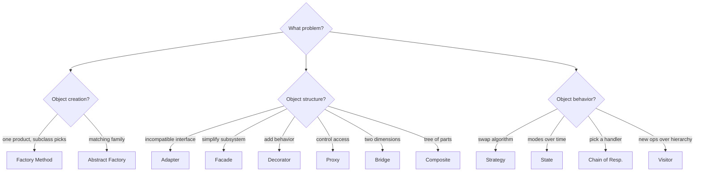

# Chapter 5 — Pattern Comparisons

> Patterns that look similar trip up beginners and interviewers alike. The structure may be identical; the **intent** differs. This chapter sharpens the decision-making.

Comparisons:
- [5.1 Factory Method vs Abstract Factory](#51-factory-method-vs-abstract-factory)
- [5.2 Strategy vs State](#52-strategy-vs-state)
- [5.3 Adapter vs Facade](#53-adapter-vs-facade)
- [5.4 Decorator vs Proxy](#54-decorator-vs-proxy)
- [5.5 Decorator vs Strategy vs Chain of Responsibility](#55-decorator-vs-strategy-vs-chain-of-responsibility)
- [5.6 Bridge vs Strategy](#56-bridge-vs-strategy)
- [5.7 Composite vs Decorator](#57-composite-vs-decorator)

---

## 5.1 Factory Method vs Abstract Factory

| Aspect | Factory Method | Abstract Factory |
|---|---|---|
| **Intent** | Create **one** product; let subclasses pick the concrete type | Create **families** of related products |
| **Granularity** | A single product | A *set* of products meant to be used together |
| **Mechanism** | Inheritance — override a method | Composition — pass/hold a factory object |
| **Unit of variation** | One overridable creation method | A whole factory implementing many creators |
| **Adds new product type** | Easy (add subclass) | Hard (must change abstract factory + all concrete factories) |
| **Adds new family** | N/A | Easy (add a new concrete factory) |

### How to decide
- Do you create **just one kind of thing**, and want subclasses to decide which? → **Factory Method**.
- Do you create **several related things** that must match (a UI theme, a DB driver set)? → **Abstract Factory**.

### Mental model
Abstract Factory is often **implemented using** several Factory Methods (one per product). Factory Method is the building block; Abstract Factory is the family-level assembly of them.

```cpp
// Factory Method: one creation point, chosen by subclass
struct Dialog { virtual std::unique_ptr<Button> createButton() = 0; };

// Abstract Factory: a bundle of creation points for a matching family
struct GUIFactory {
    virtual std::unique_ptr<Button>   createButton()   = 0;
    virtual std::unique_ptr<Checkbox> createCheckbox() = 0;  // multiple, matched
};
```

---

## 5.2 Strategy vs State

**Structurally identical** (a context delegates to a polymorphic object). The difference is *intent and dynamics*.

| Aspect | Strategy | State |
|---|---|---|
| **Intent** | Choose **how** to do something (interchangeable algorithms) | Change behavior as the object's **state** changes |
| **Who selects** | The **client** picks the strategy | Transitions happen **internally**, driven by states/context |
| **Awareness** | Strategies are independent; they don't know each other | States often know and transition to other states |
| **Lifetime** | Usually set once, rarely changes itself | Changes repeatedly during the object's life |
| **Mental cue** | "Different ways to do the same thing" | "The object is in different modes over time" |

### How to decide
- Are you swapping an **algorithm** the caller selects (sort order, compression)? → **Strategy**.
- Does the object move through **modes/lifecycle** where each mode behaves differently and triggers the next (draft→review→published, traffic light)? → **State**.

```cpp
// Strategy: client decides
sorter.setStrategy(std::make_unique<QuickSort>());

// State: the state decides the next state
void Red::next(TrafficLight& ctx) { ctx.setState(std::make_unique<Green>()); }
```

---

## 5.3 Adapter vs Facade

| Aspect | Adapter | Facade |
|---|---|---|
| **Intent** | Make an **incompatible** interface usable | **Simplify** a complex subsystem |
| **Interface** | Conforms to an **existing, expected** interface | Defines a **new, simpler** interface |
| **Scope** | Usually wraps **one** class | Wraps **many** subsystem classes |
| **Changes behavior?** | No — pure translation | No — orchestration/convenience |
| **Driven by** | Client *requires* a specific interface | Client *wants less complexity* |

### How to decide
- Do you have a target interface you **must** match (e.g., your code expects `ILogger`)? → **Adapter**.
- Do you just want a **simpler door** into a tangled subsystem? → **Facade**.

> Both are "wrappers," but Adapter *converts to a required shape*, while Facade *invents a simpler shape*.

---

## 5.4 Decorator vs Proxy

**Structurally near-identical** (both wrap an object sharing its interface). Intent differs.

| Aspect | Decorator | Proxy |
|---|---|---|
| **Intent** | **Add responsibilities/behavior** | **Control access** to the object |
| **Composition** | Often **stacked** (many decorators) | Usually a **single** proxy |
| **Knows concrete subject?** | No — wraps any Component | Often manages the real subject's **lifecycle** (creates it lazily) |
| **Typical uses** | Logging-on-top, borders, compression layers | Lazy load, caching, access control, remoting |
| **Who supplies the inner?** | Client passes the wrapped object in | Proxy often **creates/owns** the real subject |

### How to decide
- Are you **enhancing** what the object does (more features)? → **Decorator**.
- Are you **gatekeeping** when/whether/how the object is reached (lazy, secure, remote, cached)? → **Proxy**.

```cpp
// Decorator: adds behavior, client supplies inner
auto c = std::make_unique<WithMilk>(std::make_unique<SimpleCoffee>());

// Proxy: controls access, often creates the real subject itself, lazily
class ImageProxy { std::unique_ptr<RealImage> real_; /* created on first display() */ };
```

---

## 5.5 Decorator vs Strategy vs Chain of Responsibility

These three all "compose behavior," but in different shapes:

| Pattern | Shape | What varies | Flow |
|---|---|---|---|
| **Strategy** | Context → **one** strategy | The *whole* algorithm | Single delegation |
| **Decorator** | Wrapper → wrapper → core | *Added layers* of behavior, all run | Cascades through every layer |
| **Chain of Responsibility** | Handler → handler → … | *Which* handler responds | Stops when one handles it |

- **Strategy:** pick one of N algorithms. One runs.
- **Decorator:** stack N enhancements. **All** run (each adds something).
- **Chain of Responsibility:** line up N handlers. **One (or few)** runs, then it may stop.

> Decorator and CoR both form chains; the difference is Decorator's layers *all contribute*, while CoR's handlers *compete to be the one* that handles it.

---

## 5.6 Bridge vs Strategy

| Aspect | Bridge | Strategy |
|---|---|---|
| **Intent** | Separate **abstraction from implementation** so both vary | Swap an **algorithm** at runtime |
| **Dimensions** | Designed for **two parallel hierarchies** | One varying behavior |
| **Lifetime** | Implementation usually set at construction, structural | Strategy may change frequently |
| **Granularity** | Architectural (whole implementation backend) | Tactical (one operation/algorithm) |

### How to decide
- Two independent things vary (shape × renderer)? → **Bridge**.
- One behavior is pluggable (sort order)? → **Strategy**.

> Bridge is a *structural* answer to dual variation; Strategy is a *behavioral* answer to algorithmic variation. They can coexist (a Bridge's implementor could itself use Strategies).

---

## 5.7 Composite vs Decorator

Both use recursive composition (an object holds object(s) of the same interface), so they're often confused.

| Aspect | Composite | Decorator |
|---|---|---|
| **Intent** | Represent **part-whole trees**; treat leaf and group uniformly | **Add behavior** to a single object |
| **Children count** | **Many** (a collection of children) | **One** wrapped component |
| **Purpose of recursion** | Build a structure (tree) | Build a behavior pipeline (layers) |
| **Operation** | Aggregates over children | Augments the single inner call |

### How to decide
- Modeling a **tree/hierarchy** where a node may contain many children? → **Composite**.
- **Layering features** onto one object? → **Decorator**.

> Mnemonic: Composite = "**many** children, structure"; Decorator = "**one** child, behavior." They're frequently combined (a tree of decorated nodes).

---

### Decision Summary



*Next: [Chapter 6 — Design Thinking & System Design →](06-Design-Thinking-System-Design.md)*
