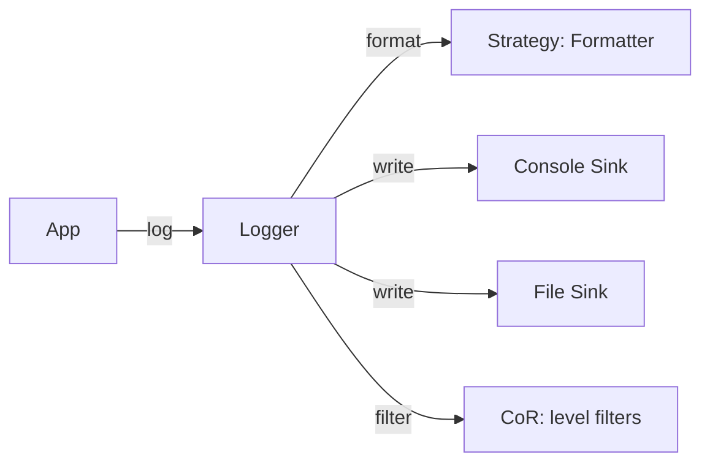
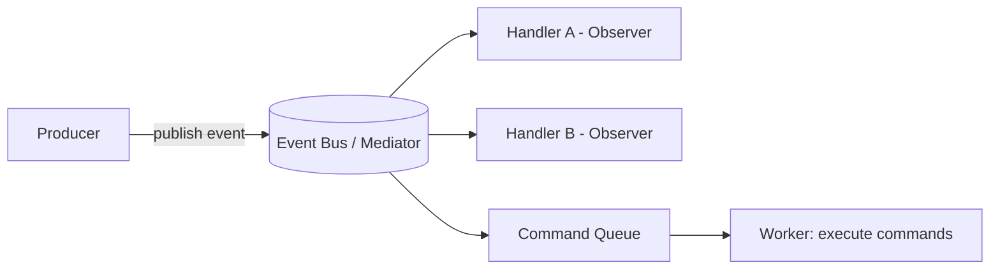

# Chapter 6 — Design Thinking & System Design

> Patterns are tools, not goals. This chapter zooms out: *how* do patterns make systems maintainable, scalable, and loosely coupled, how they map to SOLID, and how they show up in real systems.

Sections:
- [6.1 Patterns and Maintainability](#61-patterns-and-maintainability)
- [6.2 Patterns and Scalability](#62-patterns-and-scalability)
- [6.3 Patterns and Decoupling](#63-patterns-and-decoupling)
- [6.4 Mapping Patterns to SOLID](#64-mapping-patterns-to-solid)
- [6.5 Case Study: Logging Framework](#65-case-study-logging-framework)
- [6.6 Case Study: GUI Framework](#66-case-study-gui-framework)
- [6.7 Case Study: Event-Driven System](#67-case-study-event-driven-system)
- [6.8 Case Study: Automotive / Embedded Systems](#68-case-study-automotive--embedded-systems)

---

## 6.1 Patterns and Maintainability

**Maintainability = how cheaply you can change software without breaking it.** Patterns buy maintainability by *localizing change*:

- **Strategy / State / Template Method** localize *behavioral* change to one class.
- **Factory / Abstract Factory** localize *creation* change to one place — swap an implementation without touching call sites.
- **Facade** localizes *subsystem knowledge*, so subsystem refactors don't ripple to clients.
- **Observer / Mediator** localize *interaction* logic, so adding a participant doesn't require editing existing ones.

> **The litmus test:** "When requirement X changes, how many files must I edit?" Good pattern use makes that number *one*.

### The cost of over-localization
Every pattern adds indirection. Indirection has a readability cost. Maintainability improves only when the *expected rate of change* in that area justifies the abstraction. Don't pay for flexibility you won't use (see [Chapter 7](07-Anti-Patterns.md)).

---

## 6.2 Patterns and Scalability

Scalability here means **scaling the codebase and the team**, plus runtime scaling.

- **Open/Closed via polymorphic patterns** (Strategy, Factory, Visitor, Decorator) lets multiple developers add features *in parallel* by adding classes rather than editing shared files — fewer merge conflicts.
- **Flyweight** scales *memory* for millions of objects.
- **Proxy (caching/lazy)** scales *throughput/latency* by deferring or memoizing work.
- **Observer / Mediator / Command (queues)** underpin *event-driven and asynchronous* architectures that scale horizontally.
- **Prototype / Object Pool** reduce allocation pressure in high-throughput systems.

### Example: plugin architecture
A registration-based **Abstract Factory** + **Prototype** registry lets third parties add product types at runtime without recompiling the core — the backbone of extensible/plugin systems.

---

## 6.3 Patterns and Decoupling

Coupling is the enemy of change. Patterns are coupling-reduction machines:

| Coupling problem | Pattern | What it decouples |
|---|---|---|
| Client ↔ concrete class | Factory / Abstract Factory | Construction from usage |
| Subject ↔ consumers | Observer | Producer from consumers |
| Peers ↔ peers (n×n) | Mediator | Components from each other |
| Sender ↔ receiver | Command, Chain of Responsibility | Trigger from handler |
| Abstraction ↔ implementation | Bridge | Interface from backend |
| High-level ↔ low-level detail | (all, via DIP) | Policy from mechanism |

> Decoupling almost always means **introducing an interface (abstraction) between two things that used to touch directly.** Every pattern is, at heart, a disciplined way to insert the *right* interface in the *right* place.

---

## 6.4 Mapping Patterns to SOLID

Patterns are SOLID made concrete. The dominant principle each serves:

| Principle | Patterns that embody it |
|---|---|
| **SRP** (one reason to change) | Strategy, Command, Visitor, Facade, Memento |
| **OCP** (extend, don't modify) | Strategy, Decorator, Factory Method, Abstract Factory, Visitor, State, Observer |
| **LSP** (substitutability) | *Foundation* of all polymorphic patterns — every Template Method / Strategy relies on subtypes honoring the contract |
| **ISP** (small interfaces) | Adapter, Bridge, Role-based interfaces in Observer |
| **DIP** (depend on abstractions) | Abstract Factory, Factory Method, Strategy, Bridge, Observer, Command |

> **Interview tip:** When asked "why this pattern?", answer in SOLID terms. E.g., *"Strategy gives me OCP — I add a new algorithm class without modifying the context — and DIP — the context depends on the Strategy interface, not a concrete algorithm."*

---

## 6.5 Case Study: Logging Framework

A logging library is a pattern showcase.



- **Singleton** (used cautiously) or a DI-provided **service**: one global logger access point.
- **Strategy**: pluggable **formatters** (plain, JSON, key-value) and **log levels**.
- **Observer / multiple sinks**: a log record is broadcast to many **appenders** (console, file, network) — publish/subscribe.
- **Chain of Responsibility**: a pipeline of **filters** (by level, by module) decides whether a record proceeds.
- **Decorator**: wrap a sink to add buffering, async dispatch, or encryption.
- **Factory**: create sinks/formatters from configuration strings.

> Real frameworks (spdlog, log4cxx, Boost.Log) combine exactly these. The "sink + formatter + filter" trio is Strategy + Observer + CoR.

**C++ angle:** sinks behind `unique_ptr`/`shared_ptr`; async sink uses a **Command queue** (`std::function` tasks) on a worker thread; formatters as `std::function` strategies.

---

## 6.6 Case Study: GUI Framework

GUIs gave birth to many GoF patterns.

- **Composite**: the **widget tree** (a window contains panels containing buttons). Render/layout/hit-test recurse uniformly.
- **Observer**: **event/data binding** — widgets observe a model; the view updates when the model changes (MVC/MVVM).
- **Command**: **actions** behind buttons, menus, and shortcuts; enables undo/redo and keybinding remap.
- **Strategy**: **layout managers** (flow, grid, box) are interchangeable layout algorithms.
- **Abstract Factory**: **theming / cross-platform widgets** — one factory per look-and-feel produces a matching widget family.
- **Decorator**: add **borders, scrollbars, shadows** by wrapping a widget.
- **Template Method**: the base `Widget::paint()` defines the skeleton; subclasses fill in `onDraw()`.
- **Mediator**: a **dialog/form controller** coordinates its child widgets.
- **Flyweight**: shared **glyphs/icons/fonts** across thousands of UI elements.

> Qt, for instance, uses signals/slots (Observer), `QAction` (Command), layout managers (Strategy), and a widget tree (Composite).

---

## 6.7 Case Study: Event-Driven System

Message buses, reactive systems, and microservice choreography lean on behavioral patterns.



- **Observer / Pub-Sub**: producers publish events; subscribers react — the core of event-driven design.
- **Mediator (Event Bus)**: a central broker decouples producers from consumers entirely.
- **Command**: events/tasks are reified as command objects, **queued**, retried, logged, and executed asynchronously — the basis of task queues and job systems.
- **Chain of Responsibility**: **middleware pipelines** (auth → rate-limit → validate → handle) for each request/event.
- **State**: long-running workflows/sagas modeled as state machines reacting to events.
- **Memento**: **event sourcing / snapshots** to rebuild or roll back state.

**C++ angle:** an event bus stores `std::function<void(const Event&)>` subscribers; a thread-safe command queue (`std::queue<std::function<void()>>` + mutex + condition variable) feeds a worker pool.

---

## 6.8 Case Study: Automotive / Embedded Systems

Resource-constrained, safety-critical systems use patterns carefully — favoring **static/compile-time** variants to avoid heap use and unpredictability.

- **State**: ECU/device **state machines** (Init → Run → Degraded → Shutdown); diagnostic session states; AUTOSAR mode management.
- **Strategy (often template/policy-based)**: interchangeable control algorithms (PID variants, filtering) chosen at compile time for **zero overhead**.
- **Observer**: sensor value changes notify control modules (with care about ISR context and latency).
- **Command**: actuator commands queued and time-scheduled; diagnostic job requests.
- **Singleton (guarded)**: a single hardware abstraction layer handle — but often replaced by static dependency injection for testability.
- **Flyweight**: shared lookup tables/calibration data in flash.
- **Facade**: a **HAL (Hardware Abstraction Layer)** presenting a simple interface over messy peripheral registers.
- **Bridge / PIMPL-free abstraction**: separate the control logic (abstraction) from the MCU-specific driver (implementation) so the same logic ports across hardware.

### Embedded-specific constraints that reshape pattern use
- **Avoid dynamic allocation**: prefer **static polymorphism (templates/CRTP)**, object pools, and pre-allocated state objects over `new`/`shared_ptr`.
- **Determinism**: avoid patterns that introduce unbounded latency (long CoR chains, deep decorator stacks) in real-time paths.
- **No exceptions/RTTI** in many toolchains: Visitor's `dynamic_cast` and exception-based flows may be banned — use `std::variant`/`std::visit` or function tables.
- **CRTP (Curiously Recurring Template Pattern)**: the embedded-friendly way to get Strategy/Template Method behavior with **no vtable, no heap, fully inlined**:

```cpp
template <class Derived>
struct Controller {                 // Template Method via CRTP — static polymorphism
    float step(float input) {
        return static_cast<Derived*>(this)->compute(input); // resolved at compile time
    }
};
struct PID : Controller<PID> {
    float compute(float in) { /* ... */ return in; }       // no virtual call
};
```

> **Lesson:** the *concepts* (isolate variation, decouple via abstraction) are universal, but the *mechanism* shifts from runtime polymorphism (vtables, heap, smart pointers) to **compile-time polymorphism** (templates, CRTP, `constexpr`) when determinism and footprint dominate.

---

*Next: [Chapter 7 — Anti-Patterns & Common Mistakes →](07-Anti-Patterns.md)*
