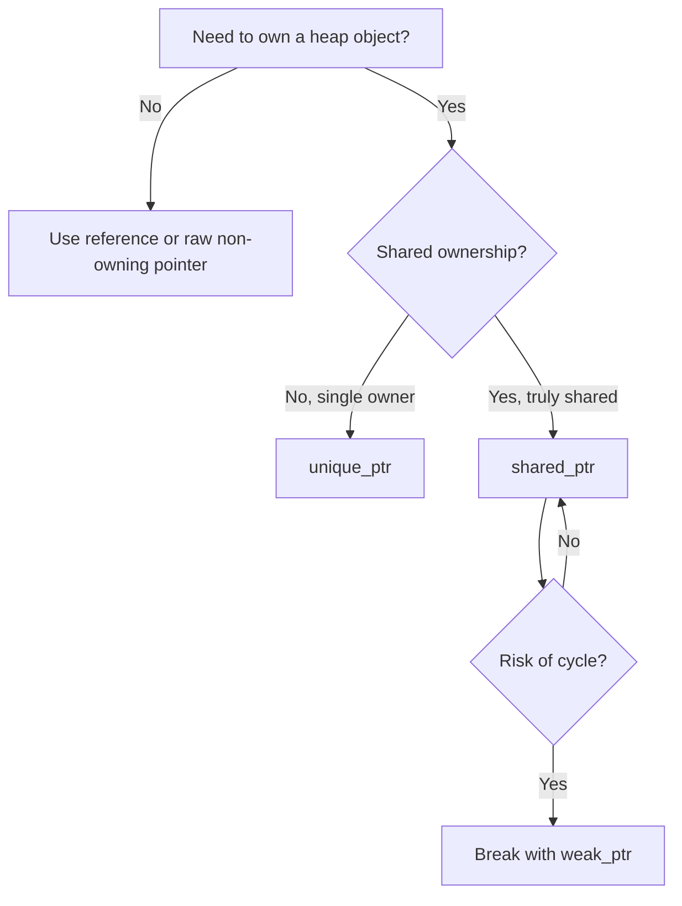

# Chapter 9 — Cheatsheets

> Fast revision. Print this chapter before an interview.

Sections:
- [9.1 One-Line Summaries](#91-one-line-summaries)
- [9.2 Pattern Selection Guide](#92-pattern-selection-guide)
- [9.3 Intent Keyword Map](#93-intent-keyword-map)
- [9.4 C++ Idiom Quick Reference](#94-c-idiom-quick-reference)
- [9.5 Pattern → SOLID Matrix](#95-pattern--solid-matrix)

---

## 9.1 One-Line Summaries

### Creational
| Pattern | One line | C++ idiom |
|---|---|---|
| **Singleton** | One instance, global access | Meyers' static local; return by ref; delete copy |
| **Factory Method** | Subclass decides which product to create | Override returns `unique_ptr<Product>` |
| **Abstract Factory** | Create matching families of products | Factory interface with multiple creators |
| **Builder** | Step-by-step construction of complex objects | Fluent setters (`return *this`), move params |
| **Prototype** | Clone an exemplar instead of constructing | Virtual `clone()` → `unique_ptr<Base>` |

### Structural
| Pattern | One line | C++ idiom |
|---|---|---|
| **Adapter** | Translate one interface to another | Object adapter via composition |
| **Bridge** | Split abstraction from implementation | Holds `shared_ptr<Impl>`; PIMPL |
| **Composite** | Treat part-whole trees uniformly | `vector<unique_ptr<Component>>` |
| **Decorator** | Add behavior by wrapping | `unique_ptr<Component>` inner member |
| **Facade** | Simple front to a complex subsystem | Thin delegating class; often + PIMPL |
| **Flyweight** | Share intrinsic state across many objects | `shared_ptr<const T>` pool/cache |
| **Proxy** | Control access to an object | `unique_ptr` lazy init; smart pointers |

### Behavioral
| Pattern | One line | C++ idiom |
|---|---|---|
| **Observer** | Auto-notify dependents on change | `weak_ptr` observer list |
| **Strategy** | Interchangeable algorithms | `unique_ptr<Strategy>` or `std::function`/template |
| **Command** | Request as an object (undo/queue/log) | `unique_ptr<Command>` history stack |
| **State** | Behavior changes with internal state | `unique_ptr<State>`; states transition |
| **Chain of Responsibility** | Pass request along handlers | `unique_ptr<Handler> next_` |
| **Mediator** | Centralize n×n interactions | Colleagues hold non-owning `Mediator*` |
| **Memento** | Snapshot/restore without breaking encapsulation | Nested `friend` Memento |
| **Template Method** | Fixed skeleton, overridable steps | NVI: non-virtual public + virtual steps |
| **Visitor** | New ops over a stable hierarchy | Double dispatch; or `std::variant`+`std::visit` |
| **Iterator** | Sequential access, hidden structure | `begin()/end()` + iterator traits |

---

## 9.2 Pattern Selection Guide

**Start with: "What varies?"**

```mermaid
graph TD
    Q[What varies / what's the pain?]
    Q --> CREATE[Object creation]
    Q --> STRUCT[Object structure/composition]
    Q --> BEHAV[Behavior/interaction]

    CREATE --> c1[One instance needed → Singleton/DI]
    CREATE --> c2[Subclass picks product → Factory Method]
    CREATE --> c3[Matching family → Abstract Factory]
    CREATE --> c4[Many optional params → Builder]
    CREATE --> c5[Copy unknown type → Prototype]

    STRUCT --> s1[Incompatible interface → Adapter]
    STRUCT --> s2[Two varying dimensions → Bridge]
    STRUCT --> s3[Tree of parts → Composite]
    STRUCT --> s4[Add features dynamically → Decorator]
    STRUCT --> s5[Simplify subsystem → Facade]
    STRUCT --> s6[Too many objects/memory → Flyweight]
    STRUCT --> s7[Control access lazy/secure → Proxy]

    BEHAV --> b1[Swap algorithm → Strategy]
    BEHAV --> b2[Modes over time → State]
    BEHAV --> b3[Notify many on change → Observer]
    BEHAV --> b4[Undo/queue/log ops → Command]
    BEHAV --> b5[Pick a handler → Chain of Resp.]
    BEHAV --> b6[Reduce n×n coupling → Mediator]
    BEHAV --> b7[Snapshot/undo state → Memento]
    BEHAV --> b8[Shared skeleton → Template Method]
    BEHAV --> b9[New ops over types → Visitor]
    BEHAV --> b10[Uniform traversal → Iterator]
```

### Quick decision table

| If you need to… | Use |
|---|---|
| Guarantee one instance | Singleton *(prefer DI)* |
| Decouple creation from use | Factory Method / Abstract Factory |
| Build complex objects readably | Builder |
| Copy without knowing the type | Prototype |
| Make incompatible code work together | Adapter |
| Vary two things independently | Bridge |
| Model hierarchies/trees | Composite |
| Add responsibilities at runtime | Decorator |
| Hide subsystem complexity | Facade |
| Save memory for many objects | Flyweight |
| Lazy-load / secure / cache access | Proxy |
| Swap algorithms at runtime | Strategy |
| Manage lifecycle states | State |
| Broadcast change notifications | Observer |
| Undo/redo, queue tasks | Command |
| Route a request to a handler | Chain of Responsibility |
| Untangle many-to-many comms | Mediator |
| Snapshot/restore state | Memento |
| Share an algorithm skeleton | Template Method |
| Add operations to a stable hierarchy | Visitor |
| Traverse a collection uniformly | Iterator |

---

## 9.3 Intent Keyword Map

When a problem statement contains these words, suspect the mapped pattern:

| Keyword in the requirement | Likely pattern |
|---|---|
| "only one", "global", "single shared" | Singleton |
| "depending on type/config, create" | Factory Method / Abstract Factory |
| "family", "matching set", "theme/skin" | Abstract Factory |
| "many optional fields", "step by step", "immutable config" | Builder |
| "copy/duplicate/clone at runtime" | Prototype |
| "legacy", "third-party", "incompatible", "convert" | Adapter |
| "platform/backend independent", "two dimensions" | Bridge |
| "tree", "part-whole", "recursive", "nested" | Composite |
| "add features", "optional behaviors", "layers", "wrap" | Decorator |
| "simplify", "one entry point", "hide complexity" | Facade |
| "millions of", "memory", "shared state", "cache identical" | Flyweight |
| "lazy", "access control", "remote", "cache result", "permission" | Proxy |
| "interchangeable", "pluggable algorithm", "swap behavior" | Strategy |
| "modes", "lifecycle", "transitions", "status changes" | State |
| "notify", "subscribe", "publish", "react to change", "event" | Observer |
| "undo", "redo", "queue", "macro", "log actions", "transaction" | Command |
| "pipeline", "pass along", "escalate", "middleware", "filter chain" | Chain of Responsibility |
| "coordinate", "central hub", "decouple components", "dialog" | Mediator |
| "snapshot", "checkpoint", "rollback", "save state" | Memento |
| "skeleton", "fixed steps", "override part of algorithm" | Template Method |
| "operations over a hierarchy", "without changing classes" | Visitor |
| "iterate", "traverse", "next/hasNext", "sequence" | Iterator |

---

## 9.4 C++ Idiom Quick Reference

| Concern | Guidance |
|---|---|
| **Default ownership** | `std::unique_ptr<T>` — exclusive, zero-overhead. The 90% choice. |
| **Shared ownership** | `std::shared_ptr<T>` — only when ownership is genuinely shared (Flyweight pool, Bridge impl shared by many). |
| **Non-owning back-reference** | `std::weak_ptr<T>` (Observer, parent links) or raw `T*` (Mediator) — breaks cycles. |
| **Polymorphic base** | Always `virtual ~Base() = default;`. Mark overrides `override`, leaf classes `final`. |
| **Copy a polymorphic object** | Virtual `clone()` returning `unique_ptr<Base>` (avoids slicing). |
| **Factory return type** | `unique_ptr<Product>` — explicit ownership transfer. |
| **Construction** | `std::make_unique` / `std::make_shared` over raw `new` (exception-safe). |
| **Builder setters** | Take by value + `std::move`; `return *this;` for fluency. |
| **Singleton** | Function-local `static` (Meyers'); thread-safe since C++11; delete copy/move; return by reference. |
| **Strategy (runtime)** | `unique_ptr<Strategy>` or `std::function`. **(compile-time)** template policy / CRTP for zero overhead. |
| **Template Method** | NVI idiom: non-virtual public method + private/protected virtual steps. |
| **Bridge** | `unique_ptr<Impl>` = PIMPL (compile firewall, ABI stability). |
| **Visitor (modern)** | `std::variant` + `std::visit` for a closed type set (no heap, no vtable). |
| **Avoid cycles** | Exactly one owning direction; the rest `weak_ptr`/raw. |
| **Embedded/RT** | Prefer CRTP/templates over virtuals; avoid heap; beware exceptions/RTTI bans. |
| **Rule of Zero** | If members are smart pointers/values, write no special members — let the compiler generate correct copy/move. |

### Smart pointer decision

---

## 9.5 Pattern → SOLID Matrix

Primary principle(s) each pattern embodies (✔ = strong association):

| Pattern | SRP | OCP | LSP | ISP | DIP |
|---|:--:|:--:|:--:|:--:|:--:|
| Singleton | | | | | |
| Factory Method | | ✔ | | | ✔ |
| Abstract Factory | | ✔ | | | ✔ |
| Builder | ✔ | | | | |
| Prototype | | ✔ | | | |
| Adapter | ✔ | | | ✔ | |
| Bridge | | ✔ | | ✔ | ✔ |
| Composite | | ✔ | ✔ | | |
| Decorator | ✔ | ✔ | ✔ | | |
| Facade | ✔ | | | | ✔ |
| Flyweight | ✔ | | | | |
| Proxy | ✔ | ✔ | ✔ | | |
| Observer | | ✔ | | ✔ | ✔ |
| Strategy | ✔ | ✔ | | | ✔ |
| Command | ✔ | ✔ | | | |
| State | ✔ | ✔ | | | |
| Chain of Responsibility | ✔ | ✔ | | | |
| Mediator | ✔ | | | | ✔ |
| Memento | ✔ | | | | |
| Template Method | | ✔ | ✔ | | |
| Visitor | ✔ | ✔ | | | |
| Iterator | ✔ | ✔ | | ✔ | |

> *Singleton is intentionally blank — it tends to **violate** DIP/SRP via global state, which is why it's the most-criticized pattern.*

---

## Final Words

- Patterns are a **shared vocabulary** and a **toolbox**, not a checklist to fill.
- Always lead with the **concept** (what varies, what to decouple), then reach for the pattern, then implement with idiomatic, **RAII-safe modern C++**.
- The best engineers know patterns *and* know when **not** to use them.

> Reread [Chapter 1 — Foundations](01-Foundations.md) and [Chapter 7 — Anti-Patterns](07-Anti-Patterns.md) periodically. Mastery is balancing *applying* patterns with *resisting* them.

*Back to [Table of Contents](00-Table-of-Contents.md)*
